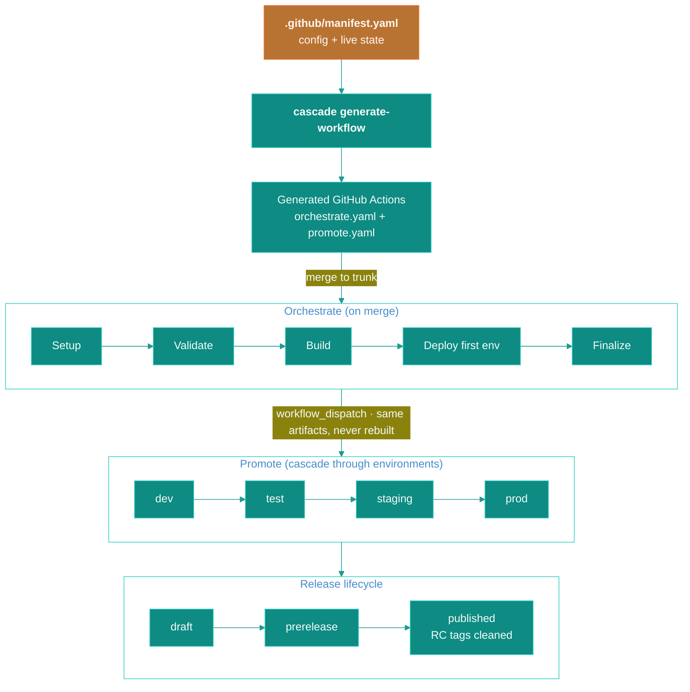

<h1 align="center">cascade</h1>

<!-- Row 1: identity & quality -->
<p align="center">
  <a href="https://pkg.go.dev/github.com/stablekernel/cascade"></a>
  <a href="https://goreportcard.com/report/github.com/stablekernel/cascade"></a>
  <a href="./go.mod"></a>
  <a href="https://stablekernel.github.io/cascade/"></a>
</p>

<!-- Row 2: project health & CI -->
<p align="center">
  <a href="https://github.com/stablekernel/cascade/actions/workflows/validate.yaml"></a>
  <a href="https://github.com/stablekernel/cascade/actions/workflows/e2e.yaml"></a>
  <a href="https://github.com/stablekernel/cascade/actions/workflows/codeql.yml"></a>
  <a href="https://securityscorecards.dev/viewer/?uri=github.com/stablekernel/cascade"></a>
  <a href="https://github.com/stablekernel/cascade/releases/latest"></a>
  <a href="./LICENSE"></a>
</p>

<p align="center">
  
</p>

<p align="center"><strong>Declarative trunk-based CI/CD for GitHub Actions.</strong></p>

<p align="center">
  Define what to build and where to deploy in one manifest.<br>
  cascade generates the GitHub Actions wiring, tracks deployment state, manages releases,<br>
  and cascades promotions through your environments.
</p>

---

## How it works

The **manifest** (`.github/manifest.yaml`) is the single source of truth. It holds both the pipeline configuration and the live deployment state for every environment. You run `cascade generate-workflow` once; after that the generated workflows own their own execution.



---

## Quick start

### 1. Install the CLI

```bash
go install github.com/stablekernel/cascade/cmd/cascade@latest
# or pin a specific version:
go install github.com/stablekernel/cascade/cmd/cascade@v0.1.0
```

### 2. Create the manifest

```yaml
# .github/manifest.yaml
ci:
  config:
    trunk_branch: main
    cli_version: v0.1.0

    environments: [dev, test, uat, prod]

    builds:
      - name: app
        workflow: .github/workflows/build-app.yaml
        triggers: [src/**, go.mod]

    deploys:
      - name: infra
        workflow: .github/workflows/deploy-infra.yaml
        triggers: [cdk/**]
      - name: app
        workflow: .github/workflows/deploy-app.yaml
        depends_on: [app]   # waits for build-app to succeed

    changelog:
      contributors: true
```

### 3. Generate the workflows

```bash
cascade generate-workflow --config .github/manifest.yaml
# Creates: .github/workflows/orchestrate.yaml
#          .github/workflows/promote.yaml
```

Commit the generated files. cascade re-generates them whenever you update the manifest; the `-f` flag overwrites in place.

### 4. Write your callbacks

cascade calls your workflows via `workflow_call` and passes standard inputs. You own the build and deploy logic.

```yaml
# .github/workflows/build-app.yaml
on:
  workflow_call:
    inputs:
      environment:
        type: string
        required: true
      sha:
        type: string
        required: true
    outputs:
      artifact_id:
        description: 'Immutable artifact identifier (e.g., Docker image digest)'
        value: ${{ jobs.build.outputs.artifact_id }}
```

cascade is a metadata courier. You construct the registry and deploy operations yourself.

---

## Capabilities

cascade generates workflows that handle the orchestration layer. Your callback workflows handle the domain logic. The manifest gives you control over:

- **Change detection**: builds and deploys run only when their declared `triggers` match changed paths.
- **Dependency ordering**: `depends_on` chains builds and deploys in the right order.
- **Matrix builds**: fan out a single build over a matrix of inputs.
- **Per-job runner selection**: set `runs_on` at the config or per-build/deploy level.
- **Concurrency control**: configurable group and cancel-in-progress on orchestrate, promote, release, and external-update workflows.
- **Extra triggers**: attach `schedule`, `repository_dispatch`, `workflow_run`, and `merge_group` events to orchestration.
- **Dispatch inputs**: expose operator-facing manual-run inputs on the generated `workflow_dispatch`.
- **PR plan preview**: a comment on each PR shows which builds and deploys would run.
- **Merge queue lane**: a dedicated gate job runs before merge to protect trunk.
- **Action pinning**: `pin_mode: sha` emits pinned SHA references for all cascade-managed action calls. Override individual actions via `action_pins`.
- **Breaking-change gate**: `feat!:` or `BREAKING CHANGE:` commits block the prerelease-to-release boundary unless you override them.
- **Artifact passing**: the `artifact_id` output from build callbacks is stored in state and forwarded to deploys and the publish callback.
- **Publish callback**: once a release is published, a separate workflow call lets you retag RC artifacts in your registry.
- **Schema version enforcement**: every CLI invocation checks `schema_version` on the manifest and rejects incompatible manifests with a clear error.

For a no-environment project (library or CLI), omit `environments` entirely. Commits produce RC pre-releases; a `promote` dispatch publishes the final release.

---

## Promotion

<!-- Promote flow described textually; see docs/images/promote-flow.png for a visual -->

Promotions are triggered via `workflow_dispatch` on the generated `promote.yaml`.

| Mode | Behavior |
|---|---|
| `default` | Advance the chain one logical step |
| `dev-to-test` | Promote dev to test |
| `dev-to-uat` | Cascade: dev → test → uat (all intermediates updated atomically) |
| `dev-to-prod` | Full cascade through all environments |
| `uat-to-prod` | Partial cascade from uat onward |

The same artifacts built on the first merge are promoted through the chain; nothing is rebuilt.

---

## State

The manifest tracks deployment state automatically. The `state:` section is managed by cascade; do not edit it by hand.

```yaml
ci:
  state:
    dev:
      sha: abc123
      version: v1.2.0-rc.3
      committed_at: "2025-01-15T10:30:00Z"
      committed_by: github-actions[bot]
      builds:
        app:
          sha: abc123
          artifact_id: sha256:def456
          built_at: "2025-01-15T10:30:00Z"
      deploys:
        infra:
          sha: abc123
          deployed_at: "2025-01-15T10:31:00Z"
    release:
      sha: abc000
      version: v1.1.0
  latest_release:
    version: v1.1.0
    sha: abc000
```

---

## CLI reference

| Command | Description |
|---|---|
| `generate-workflow` | Generate `orchestrate.yaml` and `promote.yaml` |
| `orchestrate setup` | Detect changes, compute version, plan execution |
| `orchestrate finalize` | Update state, manage release, commit manifest |
| `promote preflight` | Validate, compute promotions, check breaking changes |
| `promote finalize` | Update state after promotion deploys complete |
| `generate-changelog` | Create changelog from conventional commits |
| `manage-release` | Create, update, or publish GitHub releases |
| `next-version` | Calculate next semantic version |
| `detect-changes` | Determine which builds/deploys a file change triggers |
| `parse-config` | Validate and print the parsed manifest (with schema warnings) |
| `reset` | Wipe releases and state (for testing or a fresh start) |

Full flag reference: [docs/cli-reference.md](docs/cli-reference.md).

---

## Documentation

| Document | Description |
|---|---|
| [Getting Started](docs/getting-started.md) | Step-by-step setup guide |
| [Configuration](docs/configuration.md) | Full manifest reference |
| [Workflows](docs/workflows.md) | Orchestrate and Promote explained |
| [CLI Reference](docs/cli-reference.md) | All commands and flags |
| [Callback Contract](docs/callback-contract.md) | How to write build/deploy/publish workflows |
| [Architecture](docs/architecture.md) | System design and internals |
| [Schema Versioning](docs/versioning.md) | Compatibility policy and migration guide |

---

## Roadmap to stable

cascade is functional and self-hosted. Its own releases page shows the full pipeline running end to end. The remaining work before the v1.0.0 schema freeze falls into two areas.

**Schema coverage.** A few GitHub Actions capabilities are modeled in the manifest shape but not yet emitted by the generator: environment gates, OIDC token configuration, and per-environment runner overrides. These sit on the direct path to v1.0.0.

**Hardening.** This covers schema version enforcement (shipped), compatibility docs ([docs/versioning.md](docs/versioning.md)), and more e2e coverage. The added tests confirm that the generated workflows behave correctly under edge cases such as empty builds, cross-repo coordination, and rollback to N-1.

The manifest schema field shapes were frozen in v0.1.0 as the v1 contract baseline. Minor versions between now and v1.0.0 may add new optional fields; no existing fields will be removed or renamed before v1.0.0.

Open work is tracked in [GitHub Issues](https://github.com/stablekernel/cascade/issues).

---

## Conventions

cascade follows these conventions in its own codebase and in the generated workflows it produces:

- **Additive manifest changes**: new fields are always optional with sensible defaults, so existing manifest files keep working across minor version bumps.
- **Conventional commits**: commit messages follow `type: subject` (for example `feat:`, `fix:`, `docs:`), and the changelog generator reads this format.
- **Callback isolation**: generated workflows call your workflows via `workflow_call`, and cascade never reaches into your callback logic.
- **Metadata courier**: cascade passes artifact identifiers and versions between stages. It never touches your container registry, package registry, or deployment target directly.

---

## Development

```bash
# Build
go build -o cascade ./cmd/cascade

# Test (all packages)
go test ./...

# E2E tests (requires Docker)
cd e2e && go test -v -timeout 20m ./...

# Lint
golangci-lint run ./...

# Regenerate cascade's own workflows (uses itself)
go run ./cmd/cascade generate-workflow --config .github/manifest.yaml -f
```

---

## Contributing

Contributions are welcome. Please read [CONTRIBUTING.md](./CONTRIBUTING.md) for development setup and workflow details.

cascade uses the [Developer Certificate of Origin](https://developercertificate.org/). Sign off each commit with `git commit -s`. By participating you agree to the [Code of Conduct](./CODE_OF_CONDUCT.md).

---

## License

Apache 2.0. See [LICENSE](./LICENSE).
