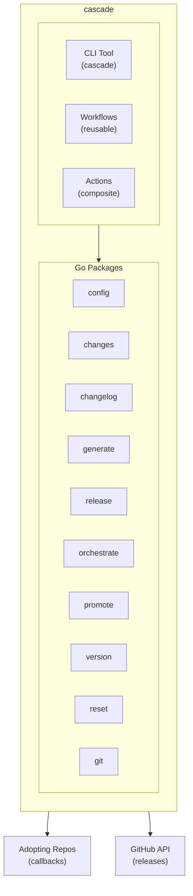
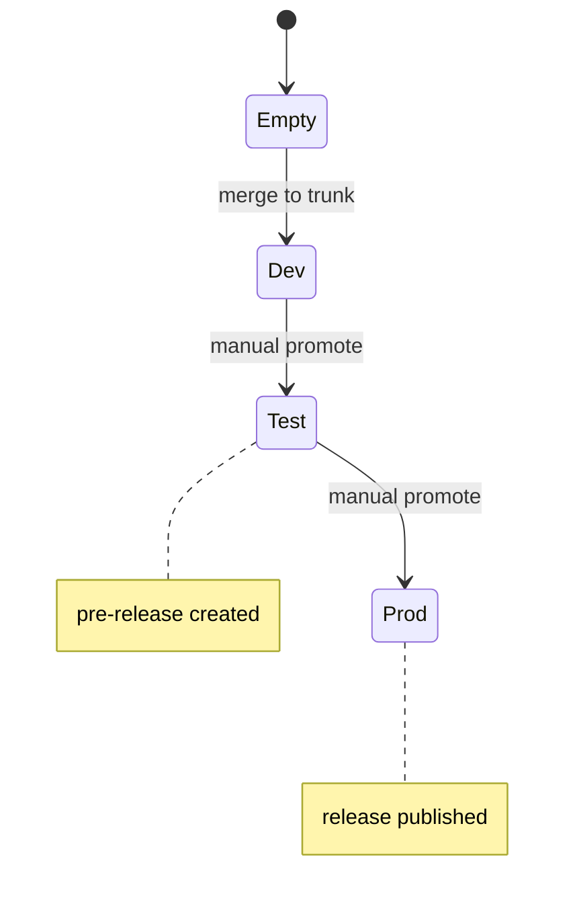
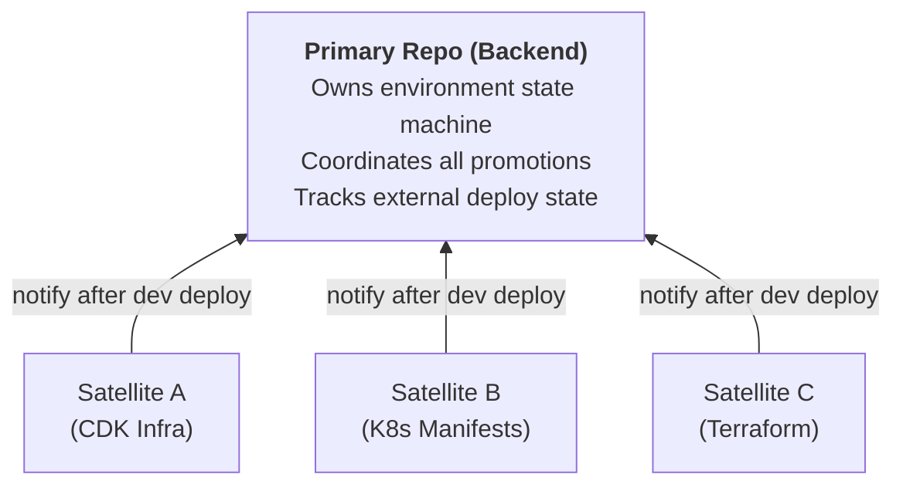
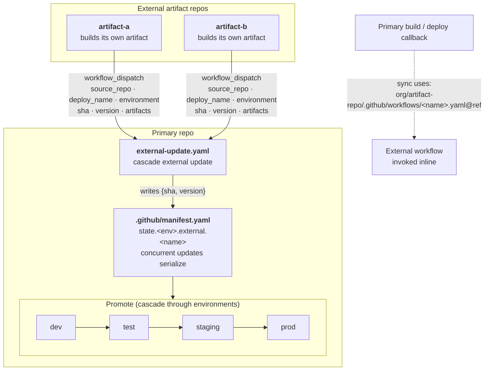

System design and internals of cascade.

## Design Principles

1. Build once, deploy everywhere. One artifact is promoted through every environment.
2. Change-driven. We build and deploy only what changed.
3. Trunk-based. A single main branch backs short-lived feature branches.
4. Callback contract. The framework orchestrates and adopting repos own build and deploy.
5. State tracking. The manifest records what is deployed where.

## System Overview



## Directory Structure

```
cascade/
├── cmd/
│   └── cascade/            # CLI entry point
│       └── main.go
├── internal/
│   ├── config/             # Config parsing and validation
│   │   ├── parse.go
│   │   ├── types.go
│   │   └── command.go
│   ├── changes/            # Change detection
│   │   ├── detect.go
│   │   ├── glob.go
│   │   └── command.go
│   ├── changelog/          # Conventional commit parsing
│   │   ├── parse.go
│   │   ├── format.go
│   │   └── command.go
│   ├── generate/           # Workflow generation
│   │   ├── generator.go
│   │   ├── graph.go
│   │   ├── workflow.go
│   │   └── command.go
│   ├── release/            # GitHub release management
│   │   ├── manager.go
│   │   └── command.go
│   ├── orchestrate/        # Main CI/CD pipeline logic
│   │   ├── setup.go
│   │   ├── finalize.go
│   │   └── command.go
│   ├── promote/            # Promotion pipeline logic
│   │   ├── preflight.go
│   │   ├── finalize.go
│   │   └── command.go
│   ├── version/            # Semantic versioning
│   │   ├── calculate.go
│   │   └── command.go
│   ├── reset/              # Test reset utility
│   │   └── command.go
│   └── git/                # Git operations
│       └── git.go
├── .github/
│   ├── actions/            # Composite actions
│   │   ├── setup-cli/
│   │   └── manage-release/
│   ├── workflows/          # Reusable workflows
│   │   ├── orchestrate.yaml
│   │   ├── promote.yaml
│   │   ├── hotfix.yaml
│   │   └── build-cli.yaml
│   └── cicd.yaml           # Self-hosting config
├── e2e/                    # End-to-end tests
│   ├── scenarios/
│   └── harness/
└── docs/                   # Documentation
```

## Go Packages

### internal/config

Parses and validates `.github/cicd.yaml`.

```go
// CICDFile combines config and state in a single structure
type CICDFile struct {
    Config TrunkConfig          `yaml:"config"`
    State  map[string]*EnvState `yaml:"state"`
}

type TrunkConfig struct {
    Project      string           `yaml:"project"`
    TrunkBranch  string           `yaml:"trunk_branch"`
    Environments []string         `yaml:"environments"`
    CLIVersion   string           `yaml:"cli_version,omitempty"`
    Git          *GitConfig       `yaml:"git,omitempty"`
    Validate     *ValidateConfig  `yaml:"validate,omitempty"`
    Builds       []BuildConfig    `yaml:"builds"`
    Deploys      []DeployConfig   `yaml:"deploys"`
    Release      *ReleaseConfig   `yaml:"release,omitempty"`
    Changelog    *ChangelogConfig `yaml:"changelog,omitempty"`
}

type BuildConfig struct {
    Name       string                    `yaml:"name"`
    Workflow   string                    `yaml:"workflow"`
    Triggers   []string                  `yaml:"triggers"`
    DependsOn  []string                  `yaml:"depends_on"`
    StateTags  []string                  `yaml:"state_tags"`
    Inputs     map[string]any            `yaml:"inputs"`
    EnvInputs  map[string]map[string]any `yaml:"env_inputs"`
    RunPolicy  string                    `yaml:"run_policy"`
    OnFailure  string                    `yaml:"on_failure"`
    Retries    int                       `yaml:"retries"`
}

type EnvState struct {
    SHA         string                  `yaml:"sha,omitempty"`
    Version     string                  `yaml:"version,omitempty"`
    CommittedAt string                  `yaml:"committed_at,omitempty"`
    CommittedBy string                  `yaml:"committed_by,omitempty"`
    Builds      map[string]*BuildState  `yaml:"builds,omitempty"`
    Deploys     map[string]*DeployState `yaml:"deploys,omitempty"`
}
```

Key methods:
- `Parse(path) -> *CICDFile, error`
- `Validate() -> []error`
- `GetTriggersForDeploy(name) -> []string`
- `GetNextEnvironment(env) -> string`
- `GetAllDirectPromotionOptions() -> []string`
- `IsFirstEnvironment(env) -> bool`
- `IsLastEnvironment(env) -> bool`

### internal/changes

Detects which builds/deploys are triggered by file changes.

```go
type DetectResult struct {
    TriggeredBuilds  []string `json:"triggered_builds"`
    TriggeredDeploys []string `json:"triggered_deploys"`
    HasChanges       bool     `json:"has_changes"`
    ChangedFiles     []string `json:"changed_files"`
}

func Detect(cfg *config.TrunkConfig, baseSHA, headSHA string) (*DetectResult, error)
```

Glob matching supports:
- `*` - any characters except `/`
- `**` - any path segments (recursive)
- `?` - single character

### internal/changelog

Parses conventional commits and generates markdown.

```go
type Commit struct {
    Hash        string
    Type        string
    Scope       string
    Description string
    Body        string
    IsBreaking  bool
}

func ParseCommit(subject, body string) *Commit
func CategorizeCommits(commits []*Commit) map[string][]*Commit
func FormatMarkdown(categories map[string][]*Commit, repo string) string
```

Categories:
- Breaking Changes (any `!` or `BREAKING CHANGE:`)
- Features (`feat`)
- Bug Fixes (`fix`)
- Other (non-routine types)

### internal/generate

Generates orchestration workflows from config.

```go
type Generator struct {
    Config     *config.TrunkConfig
    OutputDir  string
}

func (g *Generator) GenerateOrchestrate() (string, error)
func (g *Generator) GeneratePromote() (string, error)
```

Features:
- Dependency graph with topological sort
- Auto-discovers outputs from workflow files
- Generates conditional jobs per callback
- Handles `depends_on` ordering

### internal/release

Manages GitHub releases via API.

```go
type Manager struct {
    Client *http.Client
    Repo   string
}

func (m *Manager) Create(tag, name, body string, draft, prerelease bool) (*Release, error)
func (m *Manager) Update(id int, opts UpdateOptions) error
func (m *Manager) Lock(id int) error    // Mark as pre-release
func (m *Manager) Publish(id int) error // Remove pre-release flag
func (m *Manager) Delete(id int) error
```

### internal/orchestrate

Core CI/CD pipeline logic for merges to trunk.

```go
type SetupResult struct {
    TriggeredBuilds  []string `json:"triggered_builds"`
    TriggeredDeploys []string `json:"triggered_deploys"`
    Version          string   `json:"version"`
    ExecutionPlan    Plan     `json:"execution_plan"`
}

func Setup(cfg *config.CICDFile, env, baseSHA, headSHA string) (*SetupResult, error)
func Finalize(cfg *config.CICDFile, env, sha, repo string, dryRun bool) error
```

Responsibilities:
- Parse config and detect changes
- Calculate semantic version
- Build execution plan with dependency ordering
- Update state after deployment
- Create/update draft release with changelog

### internal/promote

Promotion pipeline logic for environment-to-environment promotions.

```go
type PreflightResult struct {
    SourceEnv        string   `json:"source_env"`
    TargetEnv        string   `json:"target_env"`
    SourceSHA        string   `json:"source_sha"`
    TriggeredDeploys []string `json:"triggered_deploys"`
    SkippedDeploys   []string `json:"skipped_deploys"`
    Version          string   `json:"version"`
}

func Preflight(cfg *config.CICDFile, promotion, repo string) (*PreflightResult, error)
func Finalize(cfg *config.CICDFile, promotion, sha, repo string, dryRun bool) error
```

Key features:
- Per-deployable change detection
- Determines which deploys need updates based on trigger path changes
- Handles release state transitions (draft -> pre-release -> published)

### internal/version

Semantic versioning calculation based on conventional commits.

```go
type VersionResult struct {
    Version     string `json:"version"`
    BumpType    string `json:"bump_type"`
    HasBreaking bool   `json:"has_breaking"`
    HasFeatures bool   `json:"has_features"`
}

func Calculate(cfg *config.CICDFile, env, baseSHA, headSHA string) (*VersionResult, error)
```

Algorithm:
- Breaking changes -> major bump
- Features -> minor bump
- Fixes -> patch bump
- Pre-release environments get RC suffix

### internal/reset

Testing utility for wiping releases and state.

```go
func Reset(cfg *config.CICDFile, repo string, dryRun, push bool) error
```

Actions:
- Delete all GitHub releases
- Delete all git tags
- Reset state in config file

### internal/git

Wrapper for git operations.

```go
func GetChangedFiles(baseSHA, headSHA string) ([]string, error)
func GetCommits(baseSHA, headSHA string, excludePaths []string) ([]*Commit, error)
func ConfigureIdentity(mode, userName, userEmail string) error
func SetupGPGSigning(keyID, privateKey string) error
```

## Workflow Architecture

### Orchestrate Flow

```
on-merge.yaml (adopting repo)
       │
       ▼
orchestrate.yaml (framework)
       │
       ├─► setup job
       │   ├─ Parse config
       │   ├─ Detect changes
       │   └─ Build execution plan
       │
       ├─► validate job (optional)
       │
       ├─► build jobs (matrix)
       │   └─ Per triggered build
       │
       ├─► deploy jobs (matrix)
       │   └─ Per triggered deploy, respecting depends_on
       │
       └─► finalize job
           ├─ Update manifest
           ├─ Generate changelog
           └─ Create/update release
```

### Promote Flow

```
promote.yaml (adopting repo)
       │
       ▼
promote.yaml (framework)
       │
       ├─► validate job
       │   ├─ Check source SHA
       │   ├─ Determine target env
       │   └─ Compute deploys to run
       │
       ├─► deploy jobs (matrix)
       │   └─ Per-deployable with change detection
       │
       └─► finalize job
           ├─ Update manifest (per-deploy SHAs)
           ├─ Generate changelog
           └─ Create/publish release
```

## Dependency Graph

Callbacks are ordered using topological sort:

```
builds: [app, wiremock]
deploys:
  - cdk (depends_on: [])
  - services (depends_on: [cdk, app])
  - monitoring (depends_on: [services])

Execution waves:
  Wave 1: app, wiremock, cdk  (no dependencies)
  Wave 2: services            (depends on wave 1)
  Wave 3: monitoring          (depends on wave 2)
```

## Manifest State Machine



Each environment tracks:
- `sha` - deployed commit
- `image_tag` - docker tag
- `deployed_at` - timestamp
- `deployed_by` - actor
- `version` - semver (prod only)
- `deploys` - per-deployable SHAs

## Change Detection Algorithm

```
1. Get changed files: git diff --name-only base..head

2. For each build:
   if any(changed_file matches any trigger pattern):
       mark build as triggered

3. For each deploy:
   if deploy has depends_on referencing a build:
       if that build is triggered:
           mark deploy as triggered
   else if deploy has triggers:
       if any(changed_file matches any trigger pattern):
           mark deploy as triggered
   else:
       mark deploy as triggered (unconstrained)

4. Return triggered builds/deploys
```

## Per-Deployable Tracking

For promotions, the framework tracks each deployable independently:

```
Source (dev):
  sha: abc123
  deploys:
    cdk: { sha: abc123 }
    services: { sha: abc123 }

Target (test):
  sha: def456  # older
  deploys:
    cdk: { sha: abc123 }      # already at latest
    services: { sha: def456 } # needs update

Promotion decision:
  - cdk: skip (no changes in cdk/** between abc123 and abc123)
  - services: run (changes detected)
```

## Multi-Repo Orchestration

For deployments spanning multiple repositories (e.g., backend + CDK + K8s), the framework supports coordinated promotions:

### Primary/Satellite Model



### Communication Flow

1. **Satellite deploys to dev**: Satellite runs its own orchestrate workflow
2. **Satellite notifies primary**: Dispatches to primary's `external-update.yaml`
3. **Primary updates state**: Records external deploy SHA/version in manifest
4. **Promotion includes all**: When promoting, primary triggers all deploys (local + external)

The topology above shows which repos talk to which. The flow below shows what actually moves between them: each external repo dispatches the primary's `external-update.yaml` with a payload, the primary serializes those writes into the one shared manifest, then cascades every source through its environments.



### State Tracking

Primary manifest tracks external deploys alongside local deploys:

```yaml
state:
  dev:
    sha: abc123
    deploys:
      app: { sha: abc123 }        # Local deploy
    external:
      cdk: { repo: org/cdk-infra, sha: cdk123 }     # External deploy
      k8s: { repo: org/k8s-manifests, sha: k8s456 } # External deploy
```

### Generated Workflows

For primary repos with external config:
- `external-update.yaml`: Accepts satellite notifications
- `promote.yaml`: Includes jobs for both local and external deploys

For satellite repos with notify config:
- `orchestrate.yaml`: Finalize step dispatches to primary

## Security Model

- Framework workflows run in adopting repo context
- Secrets passed via `secrets: inherit`
- Environment protection via GitHub environments
- No secrets stored in framework repo
- Cross-repo dispatch requires appropriate tokens (e.g., `PRIMARY_REPO_TOKEN`)

## Extension Points

1. **Custom Changelog**: override with `changelog.workflow`
2. **Custom Release**: override with `release.tag` for external tools
3. **Custom Inputs**: pass arbitrary inputs via `inputs`/`env_inputs`
4. **Output Chaining**: outputs auto-discovered and passed to dependents
5. **GitHub Environments**: `environment_config` per-env settings emitted by `cascade environments`; see [GitHub Deployments API and Environments REST](#github-deployments-api-and-environments-rest) below

## GitHub Deployments API and Environments REST

### What cascade does today

The generator emits an `environment: <name>` key on each deploy job whenever the manifest includes an `environments` list. That single key is enough for GitHub Actions to attach deployment records, honour required-reviewer gates, apply wait timers, and scope environment secrets. You configure all of that inside GitHub, not in the manifest.

When you opt in with `deployments.enabled: true`, the finalize job also reports deployment status through the Deployments API: it calls `POST /repos/{owner}/{repo}/deployments` to create a Deployment for the runtime-selected environment, `POST /repos/{owner}/{repo}/deployments/{id}/statuses` to mark it `in_progress`, then a terminal `success` or `failure` status once the deploy callbacks finish. See [Native deployments](/cascade/configuration/#native-deployments-opt-in) for the toggle and the per-environment `environment_url`.

### What is deferred

One capability remains out of scope for v1:

- Environments REST configuration sync. cascade does not CALL the Environments REST API: it never reads or writes environment protection rules (required reviewers, wait timers, branch policies) over the wire. The manifest can now EXPRESS that configuration, and `cascade environments` emits it as an operator-appliable file (apply with `gh api` or Terraform), but applying it stays an operator step. cascade emits; the operator applies.

### Why deferred

Keeping cascade out of the Environments REST API in v1 bounds the surface area and avoids coupling the tool to GitHub API semantics that are still evolving. Adding programmatic control before an adopter needs it would buy complexity and nothing else. If that API changes shape, cascade would have to track the change even though nothing in v1 depends on it.

### How the design reserves the extension points

The schema already carries the hooks needed to add both capabilities later without a breaking change:

**`environment_config` shape.** The manifest schema carries an `environment_config` block at the `config:` level, keyed by environment name:

```yaml
config:
  environments: [dev, test, prod]      # ordered list (source of truth), unchanged
  environment_config:                  # optional; omitting it is valid
    prod:
      gha_environment: production      # maps to the GHA environment name
      required_reviewers: [team/ops]   # user/team slugs
      wait_timer: 10                   # minutes (0..43200)
      branch_policy: protected         # protected | custom | all
      branch_patterns: [release/*]     # custom policy only
      tag_patterns: [v*]               # custom policy only
      secrets: [MY_SECRET]             # expected env-scoped secret names
      variables: [REGION]              # expected env-scoped variable names
      environment_url: https://...     # reported on the Deployment status (native deployments)
```

The protection fields (`required_reviewers`, `wait_timer`, `branch_policy`, `branch_patterns`, `tag_patterns`) and the expected `secrets` and `variables` names are real, additive fields, not reserved placeholders. `cascade environments` reads them and emits an operator-appliable file (see [environments](/cascade/cli-reference/#environments)). cascade still never calls the REST API: it forms the PUT body it can fully express from the manifest and surfaces the rest, including the reviewer slugs and the secret and variable names, under `operator_todo` for the operator to apply.

The `environments` list stays a plain ordered `[]string`; the separate `environment_config` map carries per-env settings. Adding fields under `environment_config.<name>` is additive and never touches the ordering semantics of `environments`. A manifest that omits `environment_config` entirely is valid and equivalent to today's behaviour.

**Single finalize seam.** The `orchestrate.Finalize` and `promote.Finalize` functions are the only places that write state after a deployment completes. The Deployments API status reporting attaches at exactly those two points, not scattered across the generator.

**Generator delegates environment semantics to GitHub.** Because the generator emits `environment:` and nothing more, it does not embed logic about what that environment means. Programmatic status reporting slots in at finalize time; Environments REST configuration sync is a separate operational concern that never needs to touch the generator.

### Forward-compatibility guarantee

Environments REST configuration sync, when it arrives, will follow the same additive-only policy described in [Versioning & Schema](/cascade/versioning/): new optional fields under `environment_config.<name>`, new optional top-level blocks if needed, and no removal or re-typing of existing fields. It will not require a `schema_version` bump. The Deployments API status reporting already shipped under that same policy: `deployments` and `environment_url` are additive opt-in fields that did not bump the schema version. Manifests that do not opt in to the new fields continue to work exactly as they do today.

## Testing Strategy

- Unit tests for core logic (glob matching, commit parsing)
- Integration tests for workflow generation
- Template tests for YAML validity
- PoC validation with test repository
