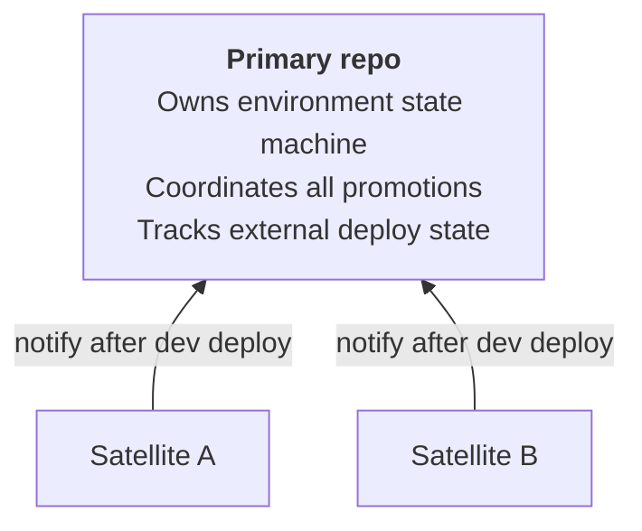

Some pipelines span more than one repository: a backend service plus a CDK stack, a set of Kubernetes manifests, or a Terraform module, each built and versioned on its own. Cascade lets one repo, the primary, own the environment state machine and promotion chain for all of them, while satellites report in after they deploy.

## The multi-repo model in brief

A satellite repo builds and deploys its own artifact to `dev` using its own orchestrate workflow, then notifies the primary. The primary records that deploy in its own manifest state and carries it through the rest of its environment chain alongside its local deploys, so one promotion advances every source together.



This is a coordination model, not a merge of repos: each satellite keeps its own history, callbacks, and release cadence. See [Architecture](/cascade/internals/architecture/) for the full design, including generated file sets on each side.

## `external` callbacks and the `external update` command

On the primary, the manifest's `external` field lists the satellite repos it coordinates and, for each, the deployables it expects to hear about. Each deployable can point at a local workflow or reference the satellite's workflow directly with `workflow: org/repo/.github/workflows/<name>.yaml@ref`. Field-level detail lives in the [manifest reference](/cascade/reference/manifest/).

Configuring `external` makes `generate-workflow` emit `external-update.yaml` on the primary. That workflow's job is to run `cascade external update`, which a satellite's own generated workflow dispatches after it deploys to `dev`:

```bash
cascade external update \
  --source-repo org/cdk-infra \
  --deploy-name cdk \
  --environment dev \
  --sha abc123 \
  --version v1.2.0 \
  --artifacts '{"image_tag": "cdk-abc123"}'
```

`external` is a parent command; `--gha-output` and `--manifest-key` are flags persistent across it and its subcommands, not `update`-only flags:

| Flag | Default | Description |
|------|---------|-------------|
| `--config` | auto-detect | Path to the primary's manifest file. |
| `--manifest-key` | `ci` | Top-level key inside the manifest. |
| `--gha-output` | `false` | Write outputs to `$GITHUB_OUTPUT` when run inside Actions. |

`update`'s own flags are `--source-repo`, `--deploy-name`, `--environment`, and `--sha` (all required), plus optional `--version` and `--artifacts` (a JSON object). The command validates that the caller is a configured primary, that the named external deploy and source repo match the manifest, and that the target environment exists, before committing the new state and pushing.

## `notify`

On the satellite side, the manifest's `notify` field is the mirror image: it names the primary repo to dispatch to once this repo's own orchestrate workflow finishes deploying to its first environment. Configuring it makes the satellite's generated orchestrate workflow dispatch to the primary automatically; you do not call `cascade external update` yourself.

`notify` needs only `repo` to point at the primary; `workflow`, `token`, `deploy_name`, and `environment` all have defaults and exist to override them when the satellite's local names differ from what the primary expects. Full field detail is in the [manifest reference](/cascade/reference/manifest/).

## Cross-repo artifact tracking

The primary writes every satellite's reported state into its own manifest, under `state.<env>.external.<name>`, alongside its local deploy state:

```yaml
state:
  dev:
    sha: abc123
    deploys:
      app: { sha: abc123 }                          # local deploy
    external:
      cdk: { repo: org/cdk-infra, sha: cdk123 }      # external deploy
      k8s: { repo: org/k8s-manifests, sha: k8s456 }  # external deploy
```

Because multiple satellites can notify the primary at nearly the same time, `external update` serializes: it commits, and if the push is rejected as non-fast-forward, it fetches the remote tip, resets onto it, and re-applies the mutation before retrying, so one satellite's update never clobbers another's. Once a source is recorded, promoting the primary carries every source, local and external, through the rest of the environment chain together.

A build or deploy callback can also pull a satellite's workflow in synchronously with `uses:` during the primary's own run, instead of waiting on a `notify` round trip. Use whichever fits: `notify` plus `external update` for independently-scheduled satellites, an inline `uses:` call when the primary should drive the satellite's build itself.

## Wayfinding

**Prerequisite**: [Manifest reference](/cascade/reference/manifest/) for the `external` and `notify` field shapes.
**Next**: [Generated workflows](/cascade/reference/generated-workflows/) for what `external-update.yaml` and the notify dispatch look like on disk.
