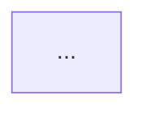

`cascade graph` turns your manifest into a Mermaid diagram on stdout. GitHub renders Mermaid natively in Markdown, so the output pastes directly into a README or pull request. `graph` is read-only: it never writes files, runs git, or modifies the repository.

## Render a diagram

```bash
cascade graph
```

With no flags, `graph` auto-detects `.github/manifest.yaml`, renders the `jobs` granularity, and prints Mermaid to stdout. Redirect it to a file or pipe it wherever you need the diagram:

```bash
cascade graph > pipeline.mmd
```

## Granularities

`--granularity` chooses the projection. Each one answers a different question about the same pipeline:

| Granularity | Default? | Shows |
|-------------|----------|-------|
| `jobs` | yes | The full job dependency graph. Hard dependencies render as solid arrows, optional ordering-only ones (`optional_depends_on`) as dotted arrows. |
| `stages` | | The coarse lifecycle flow: trunk through build, deploy, and promote to release. |
| `env` | | The promotion state machine, including any hotfix divergence and rejoin. |
| `cross-repo` | | The multi-repo flow: a lane per repository, with the primary coordinating its satellites and any satellite-to-primary notify edge. |

```bash
cascade graph --granularity env
cascade graph --granularity stages > pipeline.mmd
cascade graph --granularity cross-repo
```

Reach for `stages` or `env` when explaining the pipeline to someone new, `jobs` when debugging a dependency ordering question, and `cross-repo` on a primary repo coordinating satellites (see [Coordinate multiple repos](/cascade/guides/multi-repo/)).

## Themes

`--theme` selects the diagram's palette. Two built-ins ship, plus a custom path:

| Value | Description |
|-------|--------------|
| `cascade` (default) | The branded palette: a distinct accent color per node kind over a mid-gray edge color. |
| `bland` | A monotone grayscale palette for low-distraction or print contexts. |
| a path to a JSON file | A custom theme, in the same shape as the built-ins. |

```bash
cascade graph --theme bland
cascade graph --theme ./my-theme.json
```

A custom theme file sets a name, an optional Mermaid base theme and line color, and a fill/stroke/text style per node kind:

```json
{
  "name": "mono-blue",
  "base": "base",
  "lineColor": "#57606a",
  "nodeStyles": {
    "build": { "fill": "#1f6feb", "stroke": "#0b3d91", "text": "#ffffff" },
    "deploy": { "fill": "#1f6feb", "stroke": "#0b3d91", "text": "#ffffff" }
  }
}
```

`--format` accepts only `mermaid` today; it exists as a stable flag for a future renderer.

## Embed in a README marker block

`graph` always prints to stdout, so keeping an embedded diagram current is a paste, not an automated sync. Bound the block with HTML comments so it is easy to find and replace later:

```markdown
<!-- cascade:graph:stages -->

<!-- /cascade:graph:stages -->
```

Regenerate it whenever the pipeline shape changes:

```bash
cascade graph --granularity stages
# paste the output between the markers
```

## Wayfinding

**Prerequisite**: [Getting started](/cascade/start/getting-started/) for a manifest to render.
**Next**: none. This guide stands alone; use it alongside whichever other task guide brought you here.
