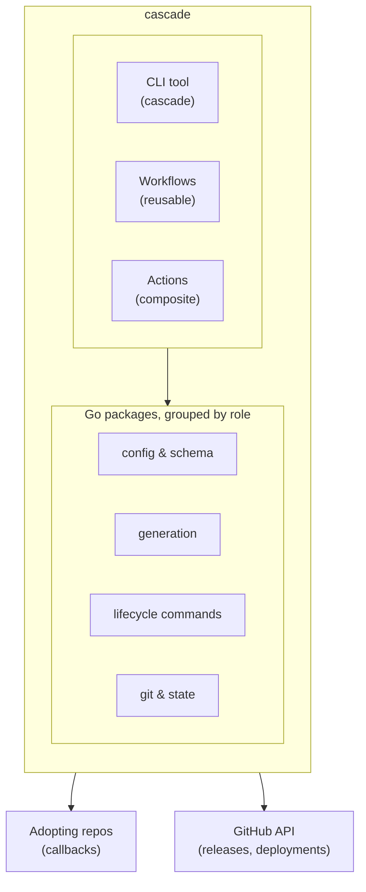
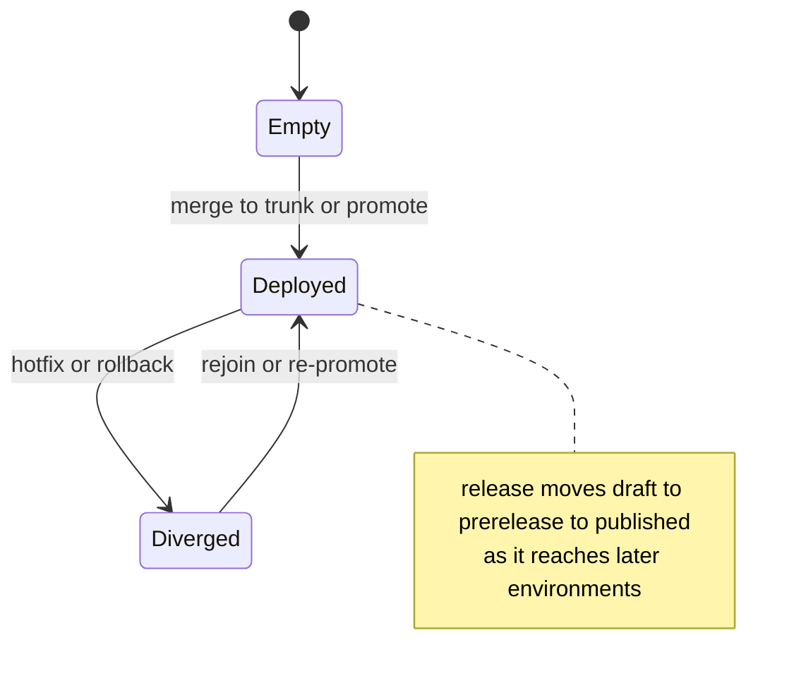

This page is for contributors and evaluators who want the internals: why cascade
is built the way it is, how its packages divide responsibility, and where the
design leaves room to grow. If you want to operate a pipeline rather than extend
the tool, start with [how cascade works](/cascade/start/how-it-works/) instead.

## Design principles

1. **Build once, promote everywhere.** One artifact moves through every environment; nothing rebuilds on the way.
2. **Change-driven.** Cascade builds and deploys only what a change actually touches.
3. **Trunk-based.** A single `main` branch backs short-lived feature branches.
4. **Callback contract.** Cascade compiles and orchestrates the pipeline; adopting repositories own build and deploy logic.
5. **State tracking.** The manifest records what is deployed where, so every decision reads from one source of truth.

## System overview

Cascade ships three surfaces from one codebase: a CLI binary, a set of reusable GitHub Actions workflows, and a handful of composite actions. The CLI is both the tool you run locally and the engine the generated workflows call at each step.

A manifest describes the pipeline; `generate-workflow` compiles it into the reusable workflows and composite actions listed in [Generated workflows](/cascade/reference/generated-workflows/). Everything downstream, from a trunk merge to a hotfix, runs through the workflows that compile step calls back into the same CLI.

## Code map

The table groups the current package tree by the role it plays, not by listing every package. It is intentionally non-exhaustive: browse `internal/` in the source tree, or run `go doc`, for the full and current list.

| Area | Representative packages | What it owns |
|---|---|---|
| Config and schema | `config`, `schema`, `environments`, `branchprotection` | Parsing and validating the manifest, schema versioning, and emitting operator-appliable environment and branch-protection config |
| Workflow generation | `generate`, `graph`, `visualize` | Compiling a manifest into GitHub Actions YAML, and rendering Mermaid diagrams of the result |
| Lifecycle commands | `orchestrate`, `promote`, `hotfix`, `rollback`, `release`, `version`, `simulate`, `plan`, `verify`, `status` | The logic behind each pipeline stage: building the execution plan, promoting between environments, hotfixing, rolling back, computing versions, and checking for drift |
| Change detection and history | `changes`, `changelog` | Mapping changed files to triggered builds and deploys, and assembling changelogs from conventional commits |
| Git, state, and reconcile | `git`, `statewrite`, `pinreconcile`, `fleetreconcile` | Git operations, the manifest state write-and-retry path, and reconciling drifted action pins |
| Cross-repo and platform | `external`, `ghaoutput`, `github` | Satellite-to-primary notification, GitHub Actions output plumbing, and the GitHub API client |
| Bootstrap and utilities | `initcmd`, `scaffold`, `reset` | Scaffolding a new manifest and topology, and the test-only reset command |

For the anatomy of what each generated workflow actually contains, see [Generated workflows](/cascade/reference/generated-workflows/); for how to operate a promotion, hotfix, or rollback, see the matching [guides](/cascade/guides/promote/).

## State machine

Every environment's manifest state advances through the same shape: empty, then deployed, then (for the release-bearing environment) published.

For each environment, the manifest tracks the deployed commit, when and by whom, the version once one applies, and a per-deployable SHA for every build and deploy so promotions can act on each artifact independently rather than the environment as a whole.

## Change detection

A build or deploy is triggered by comparing the changed files between two commits against its configured trigger patterns:

1. Get the changed files between the base and head commit.
2. For each build, mark it triggered if any changed file matches one of its trigger patterns.
3. For each deploy: if it depends on a build, it is triggered when that build is triggered; otherwise it is triggered by its own patterns, or unconditionally if it has none.
4. Builds and deploys are then ordered by `depends_on` through a topological sort, so a dependent never starts before its prerequisite.

Promotions apply the same idea per deployable, not per environment: a promotion compares the target's recorded SHA for one deployable against the source's, and only runs the deploys where that comparison shows a real change. A deployable already at the source's SHA is skipped; only ones that lag are promoted.

## Multi-repo model

For pipelines that span more than one repository, one repository is the primary: it owns the environment state machine and coordinates every promotion. Other repositories are satellites that build their own artifact and notify the primary after each deploy, so the primary's manifest becomes the single record of what is deployed where, across every repository.

See [Coordinate multiple repos](/cascade/guides/multi-repo/) for how to configure `external` and `notify` and for the operational detail this page does not repeat.

## Security model

Generated workflows run in the adopting repository's own context: secrets are passed with `secrets: inherit` or scoped per callback, environment protection comes from GitHub environments, and cross-repo dispatch requires an explicit token. Cascade's own repository stores no adopter secrets.

See [Security](/cascade/security/) for the full trust model, action-pinning policy, and hardening checklist.

## Extension points

- **Custom changelog**: override with `changelog.workflow`.
- **Custom release**: override with `release.tag` to hand releases to an external tool.
- **Custom inputs**: pass arbitrary values into a callback via `inputs` and `env_inputs`.
- **Output chaining**: a callback's outputs are auto-discovered and passed to whatever depends on it.
- **GitHub Environments**: `environment_config` lets a manifest express required reviewers, wait timers, and branch policy per environment; `cascade environments` emits that as a file for an operator to apply. Cascade never calls the Environments REST API itself, so applying the config stays a deliberate operator step. See [the manifest reference](/cascade/reference/manifest/) for the field shape.

New fields under `environment_config` and similar blocks are additive by design: a manifest that omits them is valid and behaves exactly as it does today, so this extension point can grow without a schema version bump.

## Wayfinding

**Prerequisite**: [How Cascade works](/cascade/start/how-it-works/) for the mental model this page assumes.
**Next**: [How Cascade is tested](/cascade/internals/testing/) for how each of these pieces is verified.
