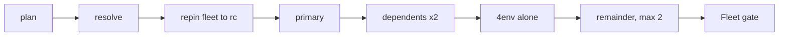

This page describes how cascade releases itself. It is maintainer CI: hand-written
tooling that lives in cascade's own repository, alongside `fleet-e2e.yaml`,
`auto-promote.yaml`, and `nightly-release.yaml`. None of it is part of cascade's
generated output. If you are adopting cascade for your own pipelines, this is
background on how the project proves and ships each version, not a feature you
configure.

The release chain is four workflows in sequence. Orchestrate cuts a release
candidate and pushes its tag. Release builds and publishes that tag's assets. The
fleet fans out across every example repository to validate the published binary.
Auto-promote publishes the final version, but only when the entire fleet is green.

## The staged fleet fan-out

The fleet ([`.github/workflows/fleet-e2e.yaml`](https://github.com/stablekernel/cascade/blob/main/.github/workflows/fleet-e2e.yaml))
revalidates the downstream `cascade-example-*` fleet on live GitHub. Every example
repository dispatches its own `scenario-suite.yaml` under one shared fleet token. A
green run means this cascade version validated across all eleven example repositories,
each running its own scenario suite in its own repository context.

Dispatching all eleven repositories at once tripped transient GitHub API failures
(401, 403, and 500 responses) on a rotating repository each run, because they all
draw on the same token. The fan-out is therefore split into sequenced lanes that
hold peak live concurrency near two repositories at a time. A `gh()` transient-retry
wrapper inside each suite remains the per-call backstop; the staging fixes the
structural burst that the wrapper alone could not absorb.



| Stage | What it does |
|---|---|
| `plan` | Parses the `repos` selector once and emits the lane gates and matrices every fan-out job keys off. This is the single place the fleet roster lives. |
| `resolve` | Gates the run, resolves the cascade version under test, and peels its tag to the underlying commit. It exposes both as outputs for the repin job and every lane. It also writes `version-under-test.txt` and a `full-run.txt` completeness marker for auto-promote to read. |
| `repin` | Re-stamps every example repository's committed workflows onto the resolved candidate before any suite lane fans out, delegating to the reusable [`suite-rc-repin.yaml`](https://github.com/stablekernel/cascade/blob/main/.github/workflows/suite-rc-repin.yaml). Every suite lane gates on it, so none starts against a stale committed ref. |
| `primary` | Runs first and must pass before its dependents start. |
| `dependents` | `artifact-a` and `artifact-b` mutate the primary's shared external state, so they run only after the primary is green. The two run together, which is the lane that defines the fleet's peak of about two repositories. |
| `heavy` | `4env` is the heaviest and most fragile repository, so it runs alone in its own job, sequenced after the dependents lane so the two never stack. |
| `remainder` | The light repositories (`3env`, `2env`, `single-env`, `release-only`, `no-env`, `callbacks`, `rollback-dispatch`) run in a matrix capped at two in flight via `max-parallel`, sequenced after the heavy lane. |
| `aggregate` | The Fleet gate. It needs every lane, so a green gate means every selected repository passed. Auto-promote keys off this conclusion. |

The fleet triggers on completion of the Release workflow (the dependable signal that
a candidate tag's assets actually reached the releases page) and on manual dispatch.

### How each suite lands on the version under test

Every example repository's committed workflow resolves the cascade actions it runs
through a `uses: stablekernel/cascade/.github/actions/setup-cli@<ref>` reference. GitHub
resolves a job's `uses:` references from the workflow file as it existed when the run was
triggered, before any workflow input or in-job step applies. A `uses:` reference is
therefore a static committed value that no dispatch input can drive, and a reference left
pointing at a throwaway candidate tag that has since been pruned kills the lane at set-up
with an unresolved-action error before the suite can do anything about it.

So the fleet re-stamps the roster centrally, just in time, before it fans out. The `repin`
job (the reusable
[`suite-rc-repin.yaml`](https://github.com/stablekernel/cascade/blob/main/.github/workflows/suite-rc-repin.yaml))
clones each repository fresh, points its manifest `cli_version` and `cli_version_sha` at
the resolved candidate, rewrites any stale in-repo prerelease references, regenerates the
workflows against the candidate binary (which rewrites the committed `setup-cli` reference
to a reference that resolves), and pushes the result to main. Every suite lane gates on a
green repin, so none starts against a stale committed reference. Candidate tags stay
throwaway: with repin-first, deleting one mid-cycle is a non-event, because the repin
re-stamps the roster onto the current candidate before any lane runs.

The separate bootstrap tooling pin (the `setup-cli` version each suite installs before
cascade is even present) is kept current by
[`suite-bootstrap-pin.yaml`](https://github.com/stablekernel/cascade/blob/main/.github/workflows/suite-bootstrap-pin.yaml),
which runs when cascade publishes a final `vX.Y.Z` release and moves each suite's
committed bootstrap pin onto it. That final-release bumper and the pre-fan-out `repin`
job never collide: they fire on different triggers (a published `vX.Y.Z` release versus
the candidate under test), target different files (each suite's `scenario-suite.yaml`
bootstrap pin versus the generated workflows plus manifest), and run under separate
concurrency groups. Because the fleet already validated that exact version
across every repository before it published, the bump is a proven no-op check rather than
a gate that can block a release.

### Changelog range on a final release

Auto-promote tags the newest candidate's exact commit as the final `vX.Y.Z`, so a final
release and its last candidate (for example `v0.8.0` and `v0.8.0-rc.7`) point at the same
commit. Left to auto-detect the previous tag, GoReleaser would pick that candidate and
compare a tag against itself, so the final release would publish an empty changelog. The
Release workflow avoids this: for a final tag it resolves the previous stable release with
[`previous-stable-tag.sh`](https://github.com/stablekernel/cascade/blob/main/.github/scripts/previous-stable-tag.sh)
and passes it as `GORELEASER_PREVIOUS_TAG`, so a final changelog spans the whole candidate
cycle (for example `v0.7.0..v0.8.0`). Candidate and dry-run tags leave the value unset and
keep their existing incremental changelogs.

## Running a single lane with the repos selector

A full fan-out is the right gate for a release, but it is heavy for developing one
example repository's suite. The `workflow_dispatch` path accepts a `repos` selector
that runs a subset of lanes:

```sh
gh workflow run fleet-e2e.yaml -f repos=4env
```

The selector accepts a single short name, or a comma or space separated list. The
default (no input, which is also the value on the Release-triggered path) is `all`,
which runs the full fleet. Only the suite lanes honor the selector; the repin job always
covers the full roster so every repository stays on the version under test regardless of
the subset. A lane the selector skips reports `skipped` and the gate treats it as
satisfied, so a subset run still produces a meaningful verdict over exactly the lanes that
ran.

A selective run never auto-promotes. The `plan` stage sets `full_run=true` only when
the selector resolves to `all`, the `resolve` stage records that marker in the
`full-run.txt` artifact, and auto-promote refuses to publish from anything other than
a full run. Only a complete fleet validation is a safe release signal.

## Release runs once per tag

Every publish path drives the same [`release.yaml`](https://github.com/stablekernel/cascade/blob/main/.github/workflows/release.yaml)
Release workflow. Each machine path fires it exactly once, through an explicit
`workflow_dispatch`. Orchestrate (the rc cut) and promote and auto-promote (the final
publish) create their tag with the default `GITHUB_TOKEN`, whose actions deliberately do
not start a workflow run, so the tag push does not fire the `push: tags` trigger. They
then dispatch Release explicitly against that tag with the release token. The dispatch is
the canonical trigger: it is immune both to a CI-skip token on the tagged commit and to
the API-release events GitHub does not reliably fire, which would otherwise leave assets unbuilt. Because the
dispatch carries the release token rather than the default token, the resulting Release
run still cascades to `fleet-e2e` through `workflow_run`.

The `push: tags` trigger stays in place for the two paths that have no dispatcher: the
hotfix tag and a human ad-hoc `git push vX.Y.Z`. Both are push-only, and their tag is
pushed with a workflow-triggering identity, so `push: tags` is their build path. The
machine paths never rely on it.

GoReleaser is the sole creator of cascade's release object. The orchestrate rc cut sets
`release.tag_only: true` in the manifest, so its `manage-release` step cuts the candidate
tag and stops there, without pre-creating a draft release. GoReleaser, running inside
Release, then creates and publishes the one release for that tag. Nothing pre-creates a
draft that GoReleaser would duplicate, so no orphaned draft is left behind. The `tag_only`
switch is scoped to cascade's own manifest; a downstream repository that has no GoReleaser
omits it and keeps the draft-then-publish flow unchanged.

A single-flight `concurrency` group named `release`, an idempotency check at the head of
the release job (`.github/scripts/release-idempotency.sh`), and a benign-`422` belt after
GoReleaser remain as a defensive backstop. They protect the hotfix and human push paths
and any genuine race: the group holds the invariant that no two releases run at once, and
the idempotency check lets a queued duplicate finish green against an already-published
tag instead of driving GoReleaser into a `422 already_exists`. On the machine paths, which
now fire once, these guards simply never engage.

## The nightly-gated release

Cascade's orchestrate workflow is dispatch-only, set through `release_trigger: dispatch`
in `.github/manifest.yaml`. A trunk merge no longer cuts a release candidate on its
own, which removes the per-merge candidate churn. The single gate that decides whether
to release is [`nightly-release.yaml`](https://github.com/stablekernel/cascade/blob/main/.github/workflows/nightly-release.yaml).

It runs on a schedule (07:00 UTC daily, off-peak, after late-day merges settle) and
owns only two jobs, `decide` and `dispatch`. Everything from Release onward is the
existing chain, reused unchanged.

`decide` measures whether main has accumulated release-worthy changes since the last
published release:

- The diff base is the latest final release tag, matching `vX.Y.Z` exactly so that a
  candidate (`-rc.`) or a leftover dry-run (`-dryrun.`) tag can never become the base.
  With no final release yet, or an unresolvable ref, it fails open and proceeds rather
  than silently skipping a real release.
- It diffs the base against `origin/main` and classifies each changed path. Code and
  the shipped action surface (`cmd/**`, `internal/**`, `go.mod`, `go.sum`,
  `.github/actions/**`) count as release-worthy. The manifest counts only when its
  non-state subtree changed, so a routine state commit alone is not release-worthy.
  Documentation, Markdown, and similar paths never trigger a release on their own.
- If nothing release-worthy changed, the run skips. A missed night just defers: the
  diff is always measured against the last release, so accumulated changes still
  release on the next run.

When `decide` says to proceed, `dispatch` dispatches orchestrate using the
`CASCADE_STATE_TOKEN`, so the candidate tag push fires Release and the chain continues.
Orchestrate cuts the candidate, Release publishes its assets, the full fleet fans out,
and auto-promote publishes the final version only on a green full run.

### On-demand inputs: force and dry_run

`nightly-release.yaml` also runs on `workflow_dispatch` with two inputs for testing
the path on demand:

- `force` bypasses the change-since-last-release skip, so an unchanged main still
  cuts a candidate. It lives entirely inside `decide` and changes nothing downstream.
- `dry_run` rehearses the whole path without publishing. The candidate is cut as a
  `vX.Y.Z-dryrun.N` prerelease instead of an `-rc.` candidate. The fleet's `resolve`
  gate accepts `-dryrun.` tags, so a dry run fans out across the full fleet and writes
  its artifacts exactly like a real candidate. Auto-promote's publish gate stays
  `-rc.`-only, so a dry-run tag can validate end to end yet is frozen out of
  publication. The `full_run` guard is a second, independent backstop.

A `force` plus `dry_run` dispatch therefore exercises every component of the real
path (the change gate bypass, the candidate cut, Release, the full fleet, the artifact
handoff, and the auto-promote wiring) while proving, by tag identity alone, that
nothing publishes.

## Wayfinding

**Prerequisite**: [Architecture](/cascade/internals/architecture/) for the system this release chain ships.
**Next**: none. This is the end of the internals track.
