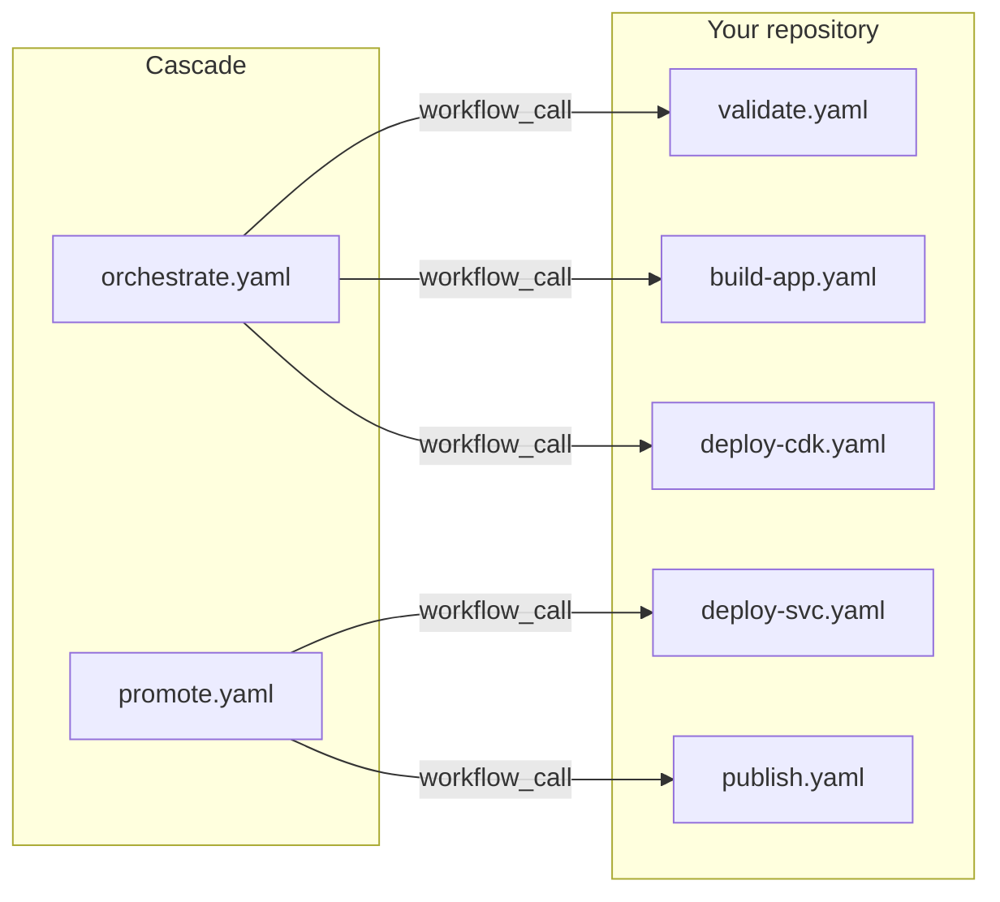

Cascade calls your workflows (callbacks) during pipeline execution. This page defines the contract those workflows must follow: what inputs they receive, what outputs they must declare, and how state flows between them.

## Callback types

| Type | Purpose | Standard inputs |
|------|---------|-----------------|
| **Validate** | Pre-build checks (lint, test) | `environment`, `sha`, `dry_run` |
| **Build** | Produce artifacts | `environment`, `sha`, `dry_run` |
| **Deploy** | Apply changes to an environment | `environment`, `sha`, `dry_run`, plus build outputs |
| **Publish** | Retag artifacts at the prerelease-to-release boundary | `build_name`, `old_version`, `new_version`, `sha`, `artifact_id` |

Every callback is a reusable workflow you declare with `workflow:` in the manifest. Cascade invokes it with `workflow_call`.



## Standard inputs

Cascade always passes these to validate, build, and deploy callbacks:

| Input | Type | Description |
|-------|------|-------------|
| `environment` | string | Target environment (for example `dev`, `test`, `prod`) |
| `sha` | string | Commit SHA being processed |
| `dry_run` | boolean | If `true`, skip mutating operations |

Any other input your callback needs must come from one of:

1. **Static `inputs:`** in the manifest.
2. **Per-environment `env_inputs:`** in the manifest.
3. **Outputs declared by a `depends_on:` callback** (auto-discovered).

Cascade parses your workflow files to discover declared `outputs:` and forwards them to dependents as inputs by name.

## Build workflow contract

Build workflows produce artifacts (Docker images, binaries).

### Required structure

```yaml
name: Build App

on:
  workflow_call:
    inputs:
      environment:
        type: string
        required: true
      sha:
        type: string
        required: true
      dry_run:
        type: boolean
        required: false
        default: false
      # Add custom inputs as needed
    outputs:
      artifact_id:
        description: Immutable artifact identifier (e.g., image digest)
        value: ${{ jobs.build.outputs.artifact_id }}
      # Add custom outputs as needed
```

### Outputs

| Output | Required | Description |
|--------|----------|-------------|
| `artifact_id` | Recommended | Immutable artifact identifier (image digest, binary checksum). Captured to state and passed to publish callbacks. |

Additional declared outputs are forwarded to dependent deploys as inputs by name.

### Example

```yaml
name: Build App

on:
  workflow_call:
    inputs:
      environment:
        type: string
        required: true
      sha:
        type: string
        required: true
      dry_run:
        type: boolean
        required: false
        default: false
      dockerfile:
        type: string
        required: false
        default: ./Dockerfile
    outputs:
      artifact_id:
        description: Image digest
        value: ${{ jobs.build.outputs.digest }}
      image_tag:
        description: Built image tag
        value: ${{ jobs.build.outputs.tag }}

jobs:
  build:
    runs-on: ubuntu-latest
    outputs:
      digest: ${{ steps.push.outputs.digest }}
      tag: ${{ steps.meta.outputs.tag }}
    steps:
      - uses: actions/checkout@v4
        with:
          ref: ${{ inputs.sha }}

      - uses: docker/setup-buildx-action@v3

      - name: Generate tag
        id: meta
        run: |
          TAG="${{ github.sha }}-$(date +%s)"
          echo "tag=$TAG" >> "$GITHUB_OUTPUT"

      - name: Build image
        uses: docker/build-push-action@v5
        with:
          context: .
          file: ${{ inputs.dockerfile }}
          push: false
          load: true
          tags: myrepo/app:${{ steps.meta.outputs.tag }}

      - name: Push image
        id: push
        if: ${{ !inputs.dry_run }}
        run: |
          docker push myrepo/app:${{ steps.meta.outputs.tag }}
          DIGEST=$(docker inspect --format='{{index .RepoDigests 0}}' \
            myrepo/app:${{ steps.meta.outputs.tag }} | cut -d@ -f2)
          echo "digest=$DIGEST" >> "$GITHUB_OUTPUT"
```

## Deploy workflow contract

Deploy workflows apply changes to an environment.

### Required structure

```yaml
name: Deploy Services

on:
  workflow_call:
    inputs:
      environment:
        type: string
        required: true
      sha:
        type: string
        required: true
      dry_run:
        type: boolean
        required: false
        default: false
      # Plus any outputs from depends_on builds (e.g., image_tag, artifact_id)
    outputs:
      # Add custom outputs as needed
```

### Receiving build outputs

When a deploy declares `depends_on: [app]` and the `app` build declares an `image_tag` output, the deploy callback receives `image_tag` as an input automatically:

```yaml
on:
  workflow_call:
    inputs:
      environment:
        type: string
        required: true
      sha:
        type: string
        required: true
      image_tag:
        type: string
        required: true   # Provided by cascade via output chaining
```

### Example

```yaml
name: Deploy Services

on:
  workflow_call:
    inputs:
      environment:
        type: string
        required: true
      sha:
        type: string
        required: true
      image_tag:
        type: string
        required: true
      dry_run:
        type: boolean
        required: false
        default: false
      cluster:
        type: string
        required: false
        default: default

jobs:
  deploy:
    runs-on: ubuntu-latest
    environment: ${{ inputs.environment }}   # Enables environment protection
    steps:
      - uses: actions/checkout@v4
        with:
          ref: ${{ inputs.sha }}

      - name: Configure AWS
        uses: aws-actions/configure-aws-credentials@v4
        with:
          role-to-assume: arn:aws:iam::123456789:role/deploy-role
          aws-region: us-east-1

      - name: Deploy
        if: ${{ !inputs.dry_run }}
        run: |
          aws ecs update-service \
            --cluster ${{ inputs.cluster }} \
            --service my-service \
            --force-new-deployment \
            --task-definition my-task:${{ inputs.image_tag }}
```

## Validate workflow contract

Optional pre-build validation.

### Required structure

```yaml
name: Validate

on:
  workflow_call:
    inputs:
      environment:
        type: string
        required: true
      sha:
        type: string
        required: true
      dry_run:
        type: boolean
        required: false
        default: false
```

### Example

```yaml
name: Validate

on:
  workflow_call:
    inputs:
      environment:
        type: string
        required: true
      sha:
        type: string
        required: true
      dry_run:
        type: boolean
        required: false
        default: false
      check_lint:
        type: boolean
        required: false
        default: true

jobs:
  validate:
    runs-on: ubuntu-latest
    steps:
      - uses: actions/checkout@v4
        with:
          ref: ${{ inputs.sha }}

      - uses: actions/setup-go@v5
        with:
          go-version: "1.25"

      - name: Lint
        if: ${{ inputs.check_lint }}
        run: golangci-lint run ./...

      - name: Test
        run: go test -v ./...
```

## Publish workflow contract

The publish callback runs once per build at the prerelease-to-release boundary (when a draft RC is published as a final semver release). Use it to retag artifacts that still carry their RC version.

### Required structure

```yaml
name: Publish

on:
  workflow_call:
    inputs:
      build_name:
        type: string
        required: true
      old_version:
        type: string
        required: true
      new_version:
        type: string
        required: true
      sha:
        type: string
        required: true
      artifact_id:
        type: string
        required: false
```

### Inputs

| Input | Description |
|-------|-------------|
| `build_name` | Which build's artifacts to retag (matches a `builds[].name`) |
| `old_version` | RC version currently in the registry (for example `v1.0.0-rc.2`) |
| `new_version` | Final semver to apply (for example `v1.0.0`) |
| `sha` | Git commit SHA |
| `artifact_id` | Immutable digest from the build's `artifact_id` output (empty if not declared) |

### Example

```yaml
name: Publish

on:
  workflow_call:
    inputs:
      build_name:
        type: string
        required: true
      old_version:
        type: string
        required: true
      new_version:
        type: string
        required: true
      sha:
        type: string
        required: true
      artifact_id:
        type: string
        required: false

jobs:
  retag:
    runs-on: ubuntu-latest
    steps:
      - name: Pull and retag
        run: |
          docker pull myrepo/${{ inputs.build_name }}:${{ inputs.old_version }}
          docker tag \
            myrepo/${{ inputs.build_name }}:${{ inputs.old_version }} \
            myrepo/${{ inputs.build_name }}:${{ inputs.new_version }}
          docker push myrepo/${{ inputs.build_name }}:${{ inputs.new_version }}
```

Cascade only carries metadata. The publish callback performs the registry operation. When `artifact_id` is present, use it instead of `old_version` so the target is unambiguous.

## Custom inputs

Pass custom inputs via `inputs` and `env_inputs` in the manifest:

```yaml
ci:
  config:
    builds:
      - name: app
        workflow: .github/workflows/build-app.yaml
        inputs:
          dockerfile: ./docker/Dockerfile.prod
          build_args: "VERSION=1.0.0"
        env_inputs:
          prod:
            sign_image: true
```

Your workflow receives them as inputs:

```yaml
on:
  workflow_call:
    inputs:
      dockerfile:
        type: string
      build_args:
        type: string
      sign_image:
        type: boolean
```

## Output chaining

Outputs from one callback are passed to dependents:

```yaml
ci:
  config:
    builds:
      - name: app
        workflow: .github/workflows/build-app.yaml
        # Outputs declared in the workflow: artifact_id, image_tag

    deploys:
      - name: services
        workflow: .github/workflows/deploy-services.yaml
        depends_on: [app]
        # Receives: artifact_id, image_tag as inputs
```

Cascade parses workflow files for `outputs:` and forwards them automatically.

## State capture

Cascade automatically captures into per-environment state:

| Field | Source | Where |
|-------|--------|-------|
| `artifact_id` | Build's `artifact_id` output | `state.<env>.builds.<name>.artifact_id` |

`artifact_id` is the canonical identifier passed to publish callbacks at release time.

```yaml
ci:
  state:
    dev:
      builds:
        app:
          sha: abc123
          built_at: "2026-01-15T10:25:00Z"
          artifact_id: "sha256:def456..."
```

Which builds and deploys get captured, and under what tags, is controlled by the `state_tags` field on the corresponding manifest entry. See the `state_tags` field in the [manifest reference](/cascade/reference/manifest/) for the full field definition.

## Environment protection

Use GitHub Environment protection for approval gates. Because every deploy is a reusable workflow, declare the `environment:` key on the job **inside your reusable workflow**. GitHub Actions only allows a job-level `environment:` key on a steps job, never on a job that calls a reusable workflow with `uses:`, so the caller job cascade generates cannot carry it.

Cascade passes the target environment name to your workflow as the `environment` input, so wire it through:

```yaml
# your reusable deploy workflow
jobs:
  deploy:
    runs-on: ubuntu-latest
    environment: ${{ inputs.environment }}   # protection lives here
    steps:
      - run: ./deploy.sh
```

Cascade cannot set `environment:` on the caller job it generates: GitHub Actions rejects a workflow that puts `environment:` on a `uses:` job. Cascade therefore emits only the `with: environment:` input on the caller and relies on your reusable workflow to apply the protection rules. Cascade prints a generate-time note when `gha_environment` is configured for an environment, reminding you to declare `environment:` inside the reusable workflow.

Configure protection in GitHub: **Settings -> Environments -> Add required reviewers**.

## Dry run handling

All callbacks should respect `dry_run`:

```yaml
- name: Deploy
  if: ${{ !inputs.dry_run }}
  run: |
    # Actual deployment

- name: Dry run preview
  if: ${{ inputs.dry_run }}
  run: |
    echo "Would deploy ${{ inputs.image_tag }}"
```

## Error handling

Callback failures are handled by the `on_failure` policy:

| Policy | Behavior |
|--------|----------|
| `abort` | Fail the entire workflow |
| `continue` | Other callbacks proceed |

With `retries: N`, failed callbacks retry up to N times before final failure.

## Migrating from inline `run:`/`shell:` callbacks

Inline `run:`/`shell:` callbacks were removed. A callback can no longer carry a `run:` script or a `shell:` setting in the manifest; it must point at a reusable workflow via `workflow:`. The manifest still parses these keys, but validation now rejects them.

To migrate, move the script into a reusable workflow under `.github/workflows/`, expose it with `on: workflow_call` (declaring the standard `environment`, `sha`, and `dry_run` inputs), and replace the callback's `run:`/`shell:` with `workflow: .github/workflows/<name>.yaml`. The script text becomes a `run:` step inside that workflow's job. The sections above show the required structure for each callback type.

## Tips

### Keep callbacks focused

- Build produces artifacts.
- Deploy applies them to an environment.
- Validate checks quality.
- Publish retags.

### Consistent naming

```
build-{name}.yaml
deploy-{name}.yaml
validate.yaml
publish.yaml
```

### Declare outputs explicitly

Cascade discovers outputs by parsing your workflow files. Declare them under `on.workflow_call.outputs`:

```yaml
outputs:
  artifact_id:
    description: Image digest
    value: ${{ jobs.build.outputs.digest }}
```

### Testing locally

```bash
# Use act to invoke workflow_call locally
act workflow_call -j build \
  --input environment=dev \
  --input sha=$(git rev-parse HEAD) \
  --input dry_run=true
```

---

**Prerequisite**: [Getting started](/cascade/start/getting-started/) walks through writing your first callbacks and generating a pipeline.

**Next**: the [manifest reference](/cascade/reference/manifest/) documents every field that configures how callbacks are wired together.
