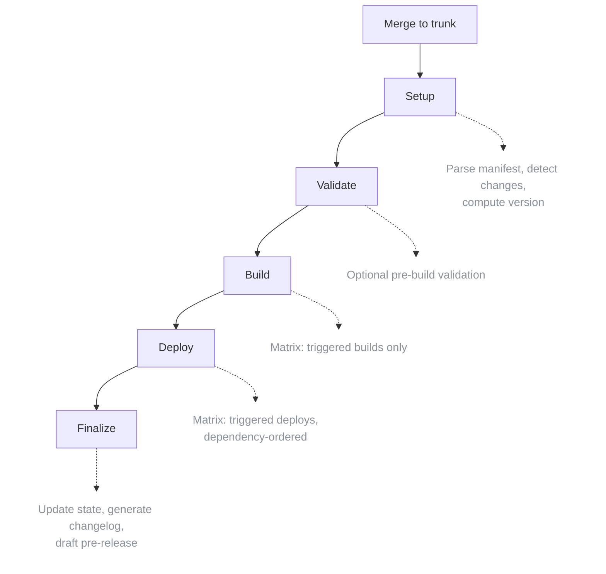
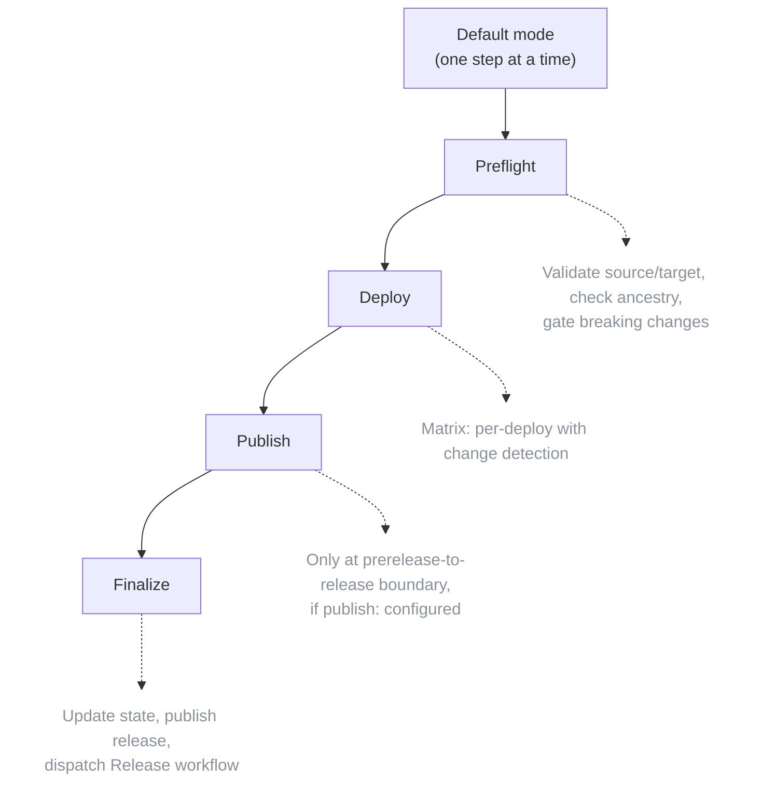

`cascade generate-workflow` compiles your manifest into GitHub Actions workflows and one composite action. This page is the structural reference: the exact files, their triggers, jobs, and outputs. For "run this, watch that" operator recipes, see the [promote](/cascade/guides/promote/), [hotfix](/cascade/guides/hotfix/), and [rollback](/cascade/guides/rollback/) guides.

## The generated file set

Every run of `generate-workflow` against an environment pipeline emits these files unconditionally:

| File | Emitted when | Purpose |
|------|--------------|---------|
| `.github/workflows/orchestrate.yaml` | always | CI/CD on trunk merges: build and deploy the first environment, cut the next rc. |
| `.github/workflows/promote.yaml` | always | Manual promotion between environments, including publish at the release boundary. |
| `.github/workflows/cascade-hotfix.yaml` | 2 or more environments configured | Roll a trunk fix onto a diverged environment. |
| `.github/workflows/cascade-rollback.yaml` | 2 or more environments configured | Re-deploy a prior version or SHA to a promoted environment. |
| `.github/actions/manage-release/action.yaml` | always | Composite action wrapping GitHub release create, update, lock, prerelease, publish, and delete. |

`orchestrate.yaml` and `promote.yaml` are two separate files by design, generated together in one run; `--orchestrate-only` or `--promote-only` limits a run to one of them. Their output paths are configurable (`--output`, `--promote-output`); `cascade-hotfix.yaml` and `cascade-rollback.yaml` are always written to those fixed paths. The action folder name defaults to `manage-release` and is configurable via `--action-folder`.

A single-environment project never gets `cascade-hotfix.yaml` or `cascade-rollback.yaml`: the first environment tracks trunk directly, so there is nothing to hotfix or roll back onto.

Any claim that `generate-workflow` emits only an orchestrate and a promote workflow is out of date. Two more workflows and a composite action are unconditional, and the opt-in companions below add more on top depending on your manifest.

## Orchestrate workflow anatomy

Orchestrate fires on every merge to the trunk branch and runs the first environment's full pipeline.



The trigger is written directly from `config.trunk_branch` (default `main`):

```yaml
on:
  push:
    branches: [main]
```

Orchestrate takes no manual inputs; it runs automatically on push. Its outputs:

| Output | Description |
|--------|-------------|
| `deployed_sha` | Deployed commit SHA. |
| `triggered_builds` / `triggered_deploys` | JSON arrays of what ran. |
| `version` | Calculated rc version, for example `v1.2.0-rc.0`. |
| `changelog` | Generated changelog markdown. |
| `release_url` | URL to the GitHub release. |
| `execution_plan` | JSON execution plan with dependency-ordered waves. |

The setup job reads the manifest's recorded SHA, diffs it against the current head, matches changed files against each callback's triggers, and builds an execution plan that respects `depends_on`. Version is computed from conventional commits since the last release: `feat!:`/`BREAKING CHANGE:` bumps major, `feat:` bumps minor, `fix:`/`perf:` bumps patch. The first environment always gets a pre-release suffix (`v1.2.0-rc.0` by default; configurable via [`tag_grammar`](/cascade/reference/manifest/#tag_grammar)); each further orchestrate run increments the pre-release counter.

## Promote workflow anatomy

Promote is a manual (`workflow_dispatch`) workflow that walks the environment chain.



Inputs: `mode` (`default` or a cascade target such as `dev-to-prod`), `force`, `allow_breaking_changes`, `dry_run`, `deploys`, `rollback_on_failure`. See the [promote guide](/cascade/guides/promote/) for what each one does operationally.

### The deploy strategy block

Each `deploy-<name>` job carries a `strategy:` block. `promote.go:writeDeployStrategyOptions` writes it from the deploy's `rollout` config:

```yaml
jobs:
  deploy-app:
    strategy:
      fail-fast: false        # rollout.fail_fast (default false when unset)
      max-parallel: 3         # rollout.max_parallel, only when > 0
      matrix:
        environment: ${{ fromJson(needs.preflight.outputs.deploy_app_matrix) }}
```

Only `fail_fast` and `max_parallel` reach this block. `rollout.type`, `rollout.canary`, and `rollout.blue_green` parse and validate but are reserved: they carry zero generator consumption today. See [Progressive rollout](/cascade/reference/versioning/#progressive-rollout) for the full reserved-field list.

### Publish

When the manifest has a `publish:` callback, promote adds a publish step that runs once per build at the prerelease-to-release boundary. It reads `artifact_id` from the source environment's build state and dispatches the publish workflow with `build_name`, `old_version`, `new_version`, `sha`, and `artifact_id`; the callback performs the registry operation (retag, copy, sign).

## Hotfix and rollback workflows

Both carry two triggers in one file and both mirror the promote deploy shape. Full operational detail lives in the [hotfix](/cascade/guides/hotfix/) and [rollback](/cascade/guides/rollback/) guides; this is the job-level anatomy.

### `cascade-hotfix.yaml`

| Job | Trigger | Role |
|-----|---------|------|
| plan | `workflow_dispatch` | Fetch env branches and tags, run `cascade hotfix plan`, surface branch-protection suggestions. |
| apply | `workflow_dispatch` (not dry-run) | Cherry-pick onto each environment bottom-up; opens a resolution pull request. |
| check | `pull_request` opened against `env/*` | Validate the manifest while the hotfix pull request is open. |
| build | merged hotfix pull request | Build the merge SHA (a cherry-pick has no prebuilt artifact). |
| deploy | merged hotfix pull request | Deploy to the target environment, paired with a rollback job mirroring promote. |
| finalize | all deploys succeed | Run `cascade hotfix finalize`: write the diverged state, tag, and release. |

Dispatch inputs: `commit` (one or more trunk fix SHAs), `target_env` (every configured environment except the first), `pr_number` (optional, to replay an existing resolution pull request), `dry_run`. The second trigger is `pull_request` on `types: [closed]` against `branches: ['env/*']`, gated on the pull request having merged with the `cascade-hotfix` label.

### `cascade-rollback.yaml`

| Job | Role |
|-----|------|
| preflight | Read-only: resolves the target version or SHA (defaults to N-1). |
| deploy | Re-runs the configured deploy callbacks keyed on the resolved SHA. |
| finalize | Writes the rolled-back state to trunk, marking the environment diverged. |

Baseline trigger is `workflow_dispatch` only, with inputs `environment`, `target`, `deployable`, `dry_run`. Setting `rollback.repository_dispatch` in the manifest adds a `repository_dispatch` trigger alongside it; every parameter read then coalesces `github.event.inputs.*` with `github.event.client_payload.*` so both paths resolve the same target. See [the rollback guide](/cascade/guides/rollback/#the-rollback-manifest-block) and the [manifest reference](/cascade/reference/manifest/) for the block's fields.

## The manage-release composite action

`.github/actions/manage-release/action.yaml` wraps GitHub release operations behind one composite action so orchestrate, promote, hotfix, and rollback all call the same code path.

| Input | Purpose |
|-------|---------|
| `action` | `create`, `update`, `lock`, `prerelease`, `publish`, or `delete`. |
| `repo`, `sha`, `tag`, `environment` | Identify the release target. |
| `changelog` | Release notes markdown. |
| `previous_tag`, `new_tag`, `delete_tag`, `create_tag` | Used by specific actions (changelog comparison, retagging, cleanup). |
| `token` | A GitHub token with repo permissions. |

Outputs: `release_id`, `release_url`, `html_url`. The action shells out to the same `cascade` binary already installed by `setup-cli`, so its behavior matches the CLI exactly.

## Opt-in companions

These emit only when their manifest block is present and enabled; an unconfigured manifest is unaffected.

| File | Enabled by | Purpose |
|------|------------|---------|
| `cascade-pr-preview.yaml` | `pr_preview.enabled: true` | Read-only PR plan preview; no deploys. |
| `cascade-drift-check.yaml` | `drift_check.enabled: true` | Fails a PR check when generated output has drifted from the manifest. |
| `cascade-drift-comment.yaml` | `drift_check.enabled: true` and `drift_check.comment: true` | Fork-safe companion that posts the drift result as a sticky PR comment. |
| `cascade-reconcile-check.yaml` | `reconcile.enabled: true` | Read-only detector for an external governed action-pin change. |
| `cascade-reconcile-companion.yaml` | `reconcile.enabled: true` | Adopts the detected pin change back into the manifest. |
| `cascade-validate.yaml` | `validate_check.enabled: true` | Runs manifest validation as its own PR check. |
| `cascade-merge-queue.yaml` | `merge_queue.enabled: true` | Adds a merge-queue validation lane. |
| `external-update.yaml` | manifest declares `external` repos | Accepts satellite deploy notifications into the primary's state; see the [multi-repo guide](/cascade/guides/multi-repo/). |

## How concurrency, timeouts, and permissions appear in output

**Concurrency.** Every cascade-owned workflow gets a top-level `concurrency:` block, but the default `cancel-in-progress` value differs by workflow because the risk differs:

| Workflow | Default group | Default `cancel-in-progress` | Why |
|----------|---------------|-------------------------------|-----|
| Orchestrate | `orchestrate-${{ github.ref }}` | `true` | A newer push obsoletes an older in-flight build. |
| Promote | `${{ github.workflow }}` | `false` | Every run pushes the same manifest state and tags; queue rather than abandon a mid-flight write. |
| Hotfix | per-environment (dispatch) or per-repo (finalize) | `false` (fixed, not configurable) | Concurrent finalize runs on different environments must not race the same trunk push. |
| Rollback | `${{ github.workflow }}` | `false` | Same reasoning as promote. |

Set `concurrency.group` and `concurrency.cancel_in_progress` in the manifest to override the orchestrate, promote, and rollback defaults; hotfix's grouping is fixed.

**Timeouts.** Cascade-owned jobs (setup, finalize, preflight, and similar) get `timeout-minutes: 30` unless `job_timeout_minutes` is set in the manifest. This never applies to your own callback jobs, since GitHub forbids `timeout-minutes` on a job that calls a reusable workflow with `uses:`; set your own timeout inside the called workflow.

**Permissions.** Each callback job gets a job-level `permissions:` block scoped to only what that callback declared, including `id-token: write` when the callback needs OIDC:

```yaml
jobs:
  deploy-app:
    permissions:
      contents: read
      id-token: write
    uses: ./.github/workflows/deploy-app.yaml
```

This is least-privilege by construction: the top-level workflow permissions stay read-only, and write scopes (`contents: write` for state pushes, `actions: write` to dispatch Release) live only on the jobs that need them.

## Wayfinding

**Prerequisite:** [How Cascade works](/cascade/start/how-it-works/) for the mental model these workflows implement.

**Next:** [Manifest reference](/cascade/reference/manifest/) for every field that shapes this output.
