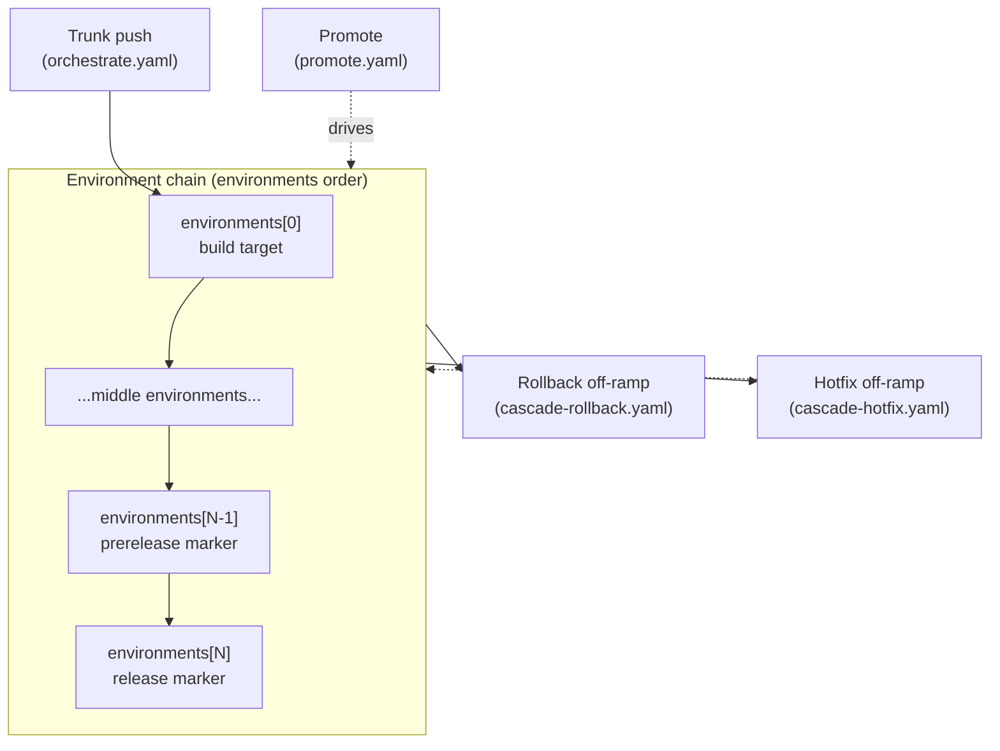

Cascade turns one manifest into a chain of stages. A change starts on trunk, moves through your environments in order, and crosses a prerelease/release boundary near the top of the chain. Two off-ramps - rollback and hotfix - branch off that line when something needs to move backward or sideways. This page is the map. It names every stage, ties each to the manifest field that turns it on and the generated workflow file that runs it, and says when it fires. Once the shape is clear, the deeper pages fill in the detail.

## The graph

The single-environment case collapses this: one environment gets a release workflow (`release.yaml`) instead of the promote chain.

## Stages

Each line below is one stage: the manifest field that enables it, the generated file that realizes it, and when it fires. The files are exactly what `cascade generate-workflow` writes, and `cascade verify` keeps them in sync with the manifest.

### Trunk -> orchestrate

Every push to your trunk branch runs the orchestrate workflow, which builds and deploys the first environment.

- **Manifest field:** `trunk_branch`, with the paths filter from `triggers` (or the per-callback triggers).
- **Generated file:** `orchestrate.yaml`.
- **Fires on:** `push` to `trunk_branch` (filtered by `triggers`) and `workflow_dispatch`. Optional `repository_dispatch`, `workflow_run`, and `merge_group` triggers come from `extra_triggers`.

### Environment chain -> promote

The `environments` list is the spine of the graph. Its order is the promotion order: a change moves from each environment to the next, one step at a time, carrying the same built artifact forward.

- **Manifest field:** `environments` (an ordered list).
- **Generated file:** `promote.yaml` for two or more environments; `release.yaml` for a single environment.
- **Fires on:** `workflow_dispatch`. You pick a promotion target (for example `dev-to-uat`) and the run advances every environment from the source up to that target.

### The prerelease/release boundary

The boundary is positional, not a named environment. The second-from-top environment is the prerelease marker: promoting into it cuts a prerelease. The top environment is the release marker: promoting into it publishes the final release. For `environments: [dev, test, uat, prod]`, promoting to `uat` marks a prerelease and promoting to `prod` publishes the release.

- **Manifest field:** position within `environments` (last = release, second-from-last = prerelease).
- **Generated file:** `promote.yaml` (the same workflow; the boundary is a property of which target you promote to).
- **Fires on:** the promote run whose target is the prerelease or release environment.

### Rollback off-ramp

Rollback moves an environment backward to a previously recorded state. It reads the deploy history cascade keeps in manifest state.

- **Manifest field:** `rollback` (and at least one environment).
- **Generated file:** `cascade-rollback.yaml`.
- **Fires on:** `workflow_dispatch`, plus `repository_dispatch` when `rollback.repository_dispatch` is set so an external signal can trigger it.

### Hotfix off-ramp

Hotfix patches an environment off a divergent branch instead of trunk, so an urgent fix can ship to one environment without waiting for the full chain. The patched ref rejoins the chain through manifest state.

- **Manifest field:** two or more `environments` (the hotfix workflow is emitted whenever the environment chain can diverge).
- **Generated file:** `cascade-hotfix.yaml`.
- **Fires on:** `workflow_dispatch`, and `pull_request` (closed) on hotfix branches to finalize the patch.

## Supporting stages

These stages are opt-in. They guard the graph rather than move artifacts through it, so they sit alongside the chain rather than on it.

### External coordination

A primary repo coordinates deploys in other repos. When the manifest lists `external` repos, cascade emits a receiver workflow that records or runs external updates.

- **Manifest field:** `external`.
- **Generated file:** `external-update.yaml`.
- **Fires on:** `workflow_dispatch` (dispatched by the satellite repo after its own deploy).

### Validate check

A pull-request gate that runs your validation callback before merge.

- **Manifest field:** `validate_check.enabled`.
- **Generated file:** `cascade-validate.yaml`.
- **Fires on:** `pull_request`.

### Merge queue

Runs orchestration for GitHub's merge queue so queued changes are checked together.

- **Manifest field:** `merge_queue.enabled`.
- **Generated file:** `cascade-merge-queue.yaml`.
- **Fires on:** `merge_group`.

### PR preview

Spins up a preview for a pull request.

- **Manifest field:** `pr_preview.enabled`.
- **Generated file:** `cascade-pr-preview.yaml`.
- **Fires on:** `pull_request`.

### Drift check

Fails a pull request when the committed workflows fall out of sync with the manifest. An optional fork-safe companion posts the result as a comment.

- **Manifest field:** `drift_check.enabled` (and `drift_check.comment` for the companion).
- **Generated file:** `cascade-drift-check.yaml`, plus `cascade-drift-comment.yaml` when `comment` is set.
- **Fires on:** `pull_request` for the check; `workflow_run` (base-repo context) for the comment companion. See the [drift-check configuration](/cascade/configuration/#drift-check-workflow-opt-in) for the pin-mode recommendation when you enable the comment lane.

## Where to go next

This page is the entry point. Follow the threads from here:

- [Manifest Reference](/cascade/configuration/) - every field behind every stage above.
- [Workflows](/cascade/workflows/) - what orchestrate, promote, and release do step by step.
- [Architecture](/cascade/architecture/) - how the generator turns the manifest into these files.
- [CLI Reference](/cascade/cli-reference/) - `generate-workflow`, `verify`, and the rest of the commands.
