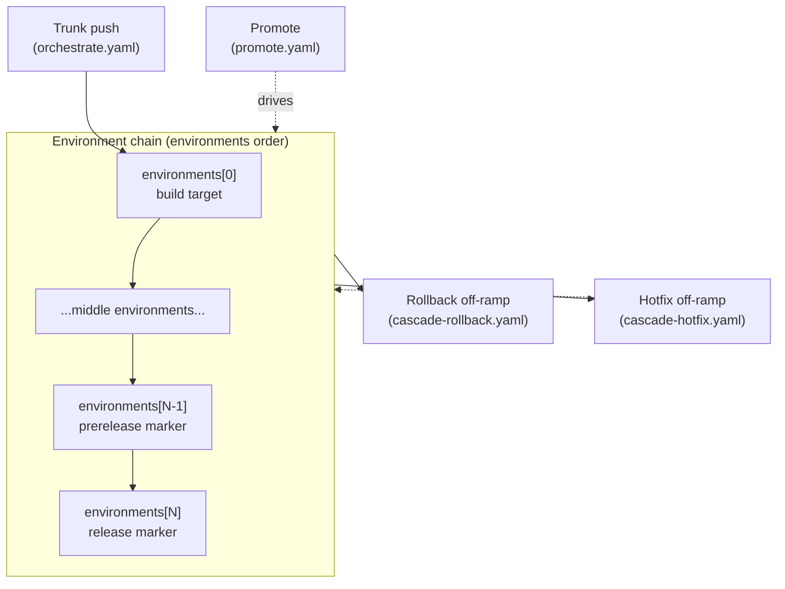

Cascade turns one manifest into a chain of stages. A change starts on trunk, moves through your environments in order, and crosses a prerelease/release boundary near the top of the chain. Two off-ramps, rollback and hotfix, branch off that line when something needs to move backward or sideways. This page is the map: it names every stage and says when it fires. The [getting started](/cascade/start/getting-started/) tutorial and the task guides fill in the how.

## The model in one diagram

The single-environment case collapses this: `promote.yaml` holds release-workflow content instead of the promote chain, so the one environment publishes directly.

## Trunk and the environment chain

Every push to your trunk branch runs the orchestrate workflow, which builds and deploys the first environment.

- **Manifest field:** `trunk_branch`, with the paths filter from `triggers` (or the per-callback triggers).
- **Generated file:** `orchestrate.yaml`.
- **Fires on:** `push` to `trunk_branch` (filtered by `triggers`) and `workflow_dispatch`. Optional `repository_dispatch` and `workflow_run` triggers come from `extra_triggers`. To participate in a merge queue, set `merge_queue.enabled` for the read-only validation lane; attaching a raw `merge_group` trigger to this side-effecting workflow is rejected at validate.

The `environments` list is the spine of the graph. Its order is the promotion order: a change moves from each environment to the next, one step at a time, carrying the same built artifact forward.

- **Manifest field:** `environments` (an ordered list).
- **Generated file:** `promote.yaml`.
- **Fires on:** `workflow_dispatch`. You pick a promotion target (for example `dev-to-uat`) and the run advances every environment from the source up to that target.

## The release boundary

The boundary is positional, not a named environment. The second-from-top environment is the prerelease marker: promoting into it cuts a prerelease. The top environment is the release marker: promoting into it publishes the final release. For `environments: [dev, test, uat, prod]`, promoting to `uat` marks a prerelease and promoting to `prod` publishes the release.

- **Manifest field:** position within `environments` (last = release, second-from-last = prerelease).
- **Generated file:** `promote.yaml` (the same workflow; the boundary is a property of which target you promote to).
- **Fires on:** the promote run whose target is the prerelease or release environment.

## Off-ramps: hotfix and rollback

**Rollback** moves an environment backward to a previously recorded state. It reads the deploy history Cascade keeps in manifest state.

- **Manifest field:** at least two `environments`; `rollback` is optional and adds an external trigger.
- **Generated file:** `cascade-rollback.yaml`.
- **Fires on:** `workflow_dispatch`, plus `repository_dispatch` when `rollback.repository_dispatch` is set so an external signal can trigger it.

**Hotfix** patches an environment off a divergent branch instead of trunk, so an urgent fix can target one environment without waiting for the full chain. The patched ref rejoins the chain through manifest state. The workflow cherry-picks, builds, tags, and releases the fix; its deploy jobs are placeholders for now, so running the configured deploy workflow is a manual step (see [Run a hotfix](/cascade/guides/hotfix/)).

- **Manifest field:** two or more `environments` (the hotfix workflow is emitted whenever the environment chain can diverge).
- **Generated file:** `cascade-hotfix.yaml`.
- **Fires on:** `workflow_dispatch`, and `pull_request` (closed) on hotfix branches to finalize the patch.

For the operator-level walkthrough of each, see [Run a hotfix](/cascade/guides/hotfix/) and [Roll back an environment](/cascade/guides/rollback/).

## Supporting lanes

These lanes are opt-in. They guard the graph rather than move artifacts through it, so they sit alongside the chain rather than on it.

| Lane | Manifest field | Generated file | Fires on |
|---|---|---|---|
| External coordination | `external` | `external-update.yaml` | `workflow_dispatch`, dispatched by a satellite repo after its own deploy |
| Validate check | `validate_check.enabled` | `cascade-validate.yaml` | `pull_request` |
| Merge queue | `merge_queue.enabled` | `cascade-merge-queue.yaml` | `merge_group` |
| PR preview | `pr_preview.enabled` | `cascade-pr-preview.yaml` | `pull_request` |
| Drift check | `drift_check.enabled` (`drift_check.comment` for the companion) | `cascade-drift-check.yaml`, plus `cascade-drift-comment.yaml` when `comment` is set | `pull_request` for the check; `workflow_run` for the comment companion |

A primary repo coordinates deploys in other repos through the external lane: when the manifest lists `external` repos, Cascade emits a receiver workflow that records or runs external updates. PR preview spins up a preview environment for a pull request; see its field in the [manifest reference](/cascade/reference/manifest/). Drift check fails a pull request when the committed workflows fall out of sync with the manifest.

Every field above is documented in full in the [manifest reference](/cascade/reference/manifest/), and every generated file's internal anatomy is in [generated workflows reference](/cascade/reference/generated-workflows/).

## One repo, several components

Everything above describes one unit moving through one chain. If a repository holds
more than one thing to ship, such as an API and a web frontend, a `components:`
block gives each its own version line, environment ladder, and promotion, hotfix,
and rollback history, all from the same trunk and the same manifest. Each component
runs the model on this page in its own isolated namespace.

Components are additive: a manifest with no `components:` block is a single implicit
component that spans the whole repository and behaves exactly as described here. See
[Split a repo into components](/cascade/guides/components/) for the walkthrough.

---

**Prerequisite:** [Why Cascade](/cascade/start/why-cascade/).
**Next:** [Getting started](/cascade/start/getting-started/) to build your first pipeline.
