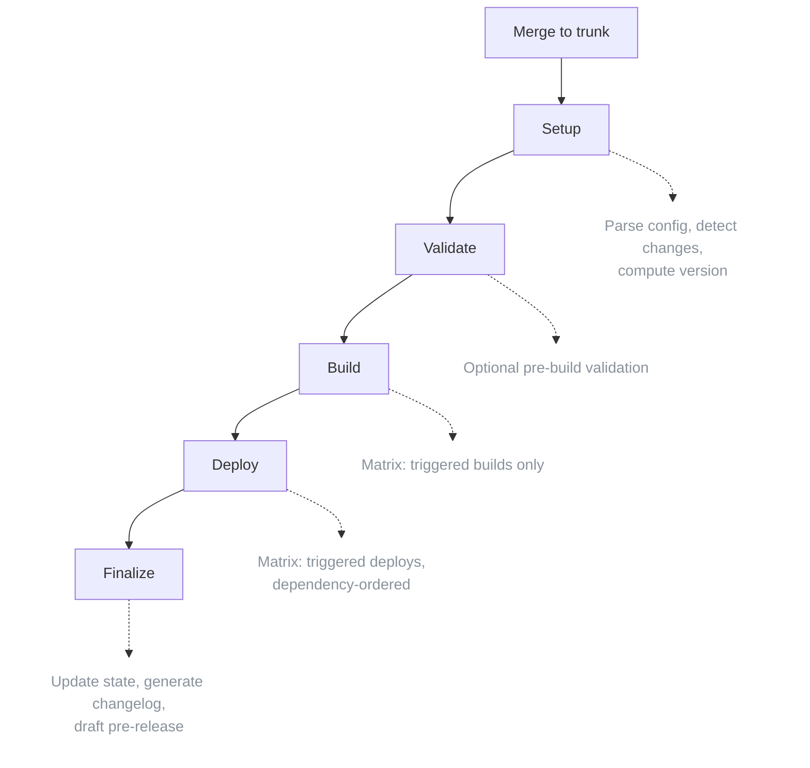
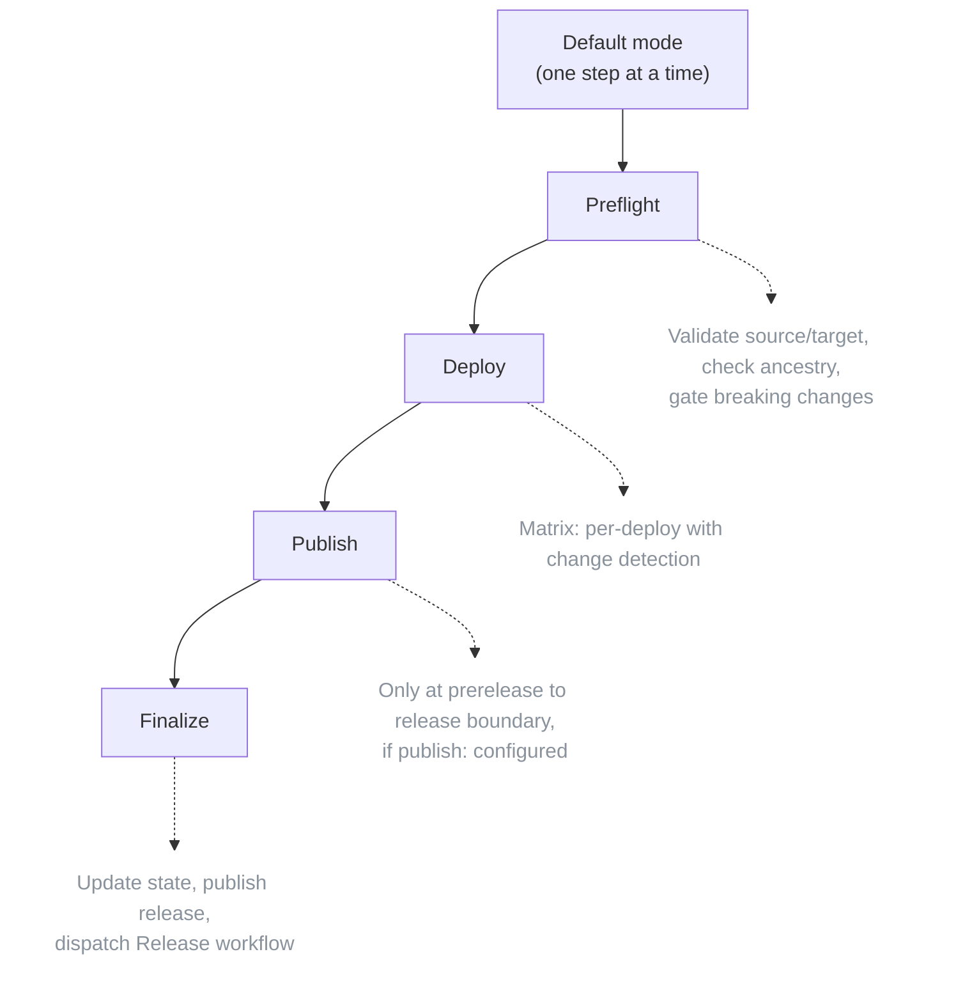
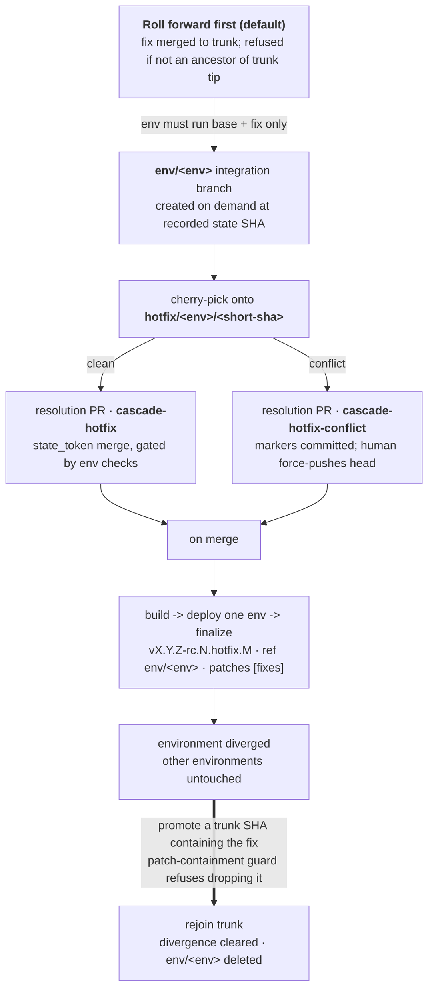

The framework generates two reusable workflows from your manifest: **Orchestrate** and **Promote**. Both are written by `cascade generate-workflow`.

## Orchestrate

Triggered on every merge to trunk. Handles the full CI/CD pipeline for the first environment in the promotion chain.

### Flow



### Triggering

The orchestrate workflow is generated to fire on `push` to the trunk branch. You don't need to wrap it. The generator emits the trigger directly:

```yaml
# .github/workflows/orchestrate.yaml (generated)
on:
  push:
    branches: [master]   # taken from config.trunk_branch
```

### Standard Inputs

The orchestrate workflow has no manual inputs by default. It runs automatically on push.

### Outputs

| Output | Description |
|--------|-------------|
| `deployed_sha` | Deployed commit SHA |
| `triggered_builds` | JSON array of triggered builds |
| `triggered_deploys` | JSON array of triggered deploys |
| `version` | Calculated RC version (e.g., `v1.2.0-rc.0`) |
| `changelog` | Generated changelog markdown |
| `release_url` | URL to the GitHub release |
| `execution_plan` | JSON execution plan with waves |

### Change Detection

The setup job determines what to build/deploy:

1. Reads the manifest to get the last deployed SHA (base)
2. Compares base to the current SHA (head)
3. Matches changed files against triggers
4. Builds an execution plan respecting `depends_on`

Example output:
```json
{
  "triggered_builds": ["app"],
  "triggered_deploys": ["cdk", "services"],
  "has_changes": true,
  "execution_plan": {
    "waves": [
      {"name": "wave-1", "callbacks": ["app", "cdk"]},
      {"name": "wave-2", "callbacks": ["services"]}
    ]
  }
}
```

### Version Calculation

The version is computed from conventional commits between the previous release and the current SHA:

| Commits since last release | Bump |
|---------------------------|------|
| `feat!:` or `BREAKING CHANGE:` | major |
| `feat:` | minor |
| `fix:` / `perf:` | patch |

The first environment receives an RC suffix: e.g., `v1.2.0-rc.0`. Each subsequent orchestrate run increments the RC counter.

## Promote

Manual workflow to promote between environments.

### Flow



A cascade mode (e.g., `dev-to-prod`) walks the chain step by step, running deploy/finalize for each intermediate environment, with the breaking-change gate enforced at the prerelease->release boundary.

### Triggering (Generated)

```yaml
# .github/workflows/promote.yaml (generated excerpt)
on:
  workflow_dispatch:
    inputs:
      mode:
        description: 'Promotion mode - default (sequential) or select a cascade target'
        type: choice
        required: true
        options:
          - default
          - dev-to-test
          - test-to-prod
          - dev-to-prod
          # ... all valid direct cascade targets
        default: default
      force:
        description: 'Continue on failure (default mode only)'
        type: boolean
        default: false
      allow_breaking_changes:
        description: 'Required if promoting breaking changes past pre-release → release'
        type: boolean
        default: false
      dry_run:
        description: 'Dry run mode'
        type: boolean
        default: false
      deploys:
        description: 'Deploys to promote (comma-separated names or "all")'
        type: string
        default: 'all'
      rollback_on_failure:
        description: 'Revert successful deploys if any fails (atomic promotion)'
        type: boolean
        default: true
```

### Inputs

| Input | Type | Default | Description |
|-------|------|---------|-------------|
| `mode` | choice | `default` | `default` or a cascade target (e.g., `dev-to-prod`) |
| `force` | boolean | false | Continue on failure (default mode only) |
| `allow_breaking_changes` | boolean | false | Required to cross the prerelease->release boundary with breaking changes |
| `dry_run` | boolean | false | Preview without deploying |
| `deploys` | string | `all` | Comma-separated deploy names or `all` |
| `rollback_on_failure` | boolean | true | Atomic semantics: revert on failure |

### Outputs

| Output | Description |
|--------|-------------|
| `source_sha` | SHA being promoted |
| `target_env` | Destination environment |
| `rollback_sha` | SHA to revert to on failure |
| `deploys_to_run` | JSON array of deploys to run |
| `external_deploys_to_run` | JSON array of external deploys to run |
| `version` | Version applied to the target |
| `changelog` | Changelog since the previous release |
| `release_url` | URL to the GitHub release |

### Atomic Promotions with Rollback

The promote workflow can run atomic promotions. If any deploy fails, the deploys that already succeeded are rolled back:

```yaml
# Enabled by default
rollback_on_failure: true
```

When enabled:
1. Preflight captures the target environment's current SHA as `rollback_sha`
2. If any deploy job fails, rollback jobs trigger for successful deploys
3. Rollback jobs redeploy using the `rollback_sha`

The result is all-or-nothing promotion: either every deploy lands or none does.

Disable for non-atomic promotions:
```yaml
rollback_on_failure: false
```

### Selective Deployments

Use the `deploys` input to promote specific deploys:

```yaml
deploys: "app,infra"   # Only promote app and infra
deploys: "all"         # Promote all (default)
```

### Per-Deployable Change Detection

The promote workflow uses diff-based detection:

1. For each deployable, compare the target's last deployed SHA with the source SHA
2. Check whether trigger paths have changes
3. Only run deploys with actual changes

This prevents unnecessary deploys (e.g., don't redeploy CDK if only services changed).

### Promotion Modes

The mode dropdown is generated from the configured `environments` list. The env names and the resulting `<from>-to-<to>` modes come from your own configuration, not from fixed names; roles are positional (last = release stage, second-to-last = prerelease).

**Default mode** advances the chain by one logical step (next env, or release/prod at the boundary).

**Cascade modes** are explicit `from-to-to` walks generated for every valid forward pair:

| Mode (example) | Behavior |
|----------------|----------|
| `dev-to-test` | Promote dev -> test |
| `dev-to-uat` | Cascade dev -> test -> uat (each step deployed and finalized) |
| `dev-to-prod` | Full cascade through all environments + release |
| `uat-to-prod` | Partial cascade from uat onward |
| `test-to-prod` | Standard release |

Cascade promotions are atomic per environment. The breaking-change gate runs at the prerelease->release boundary; pass `allow_breaking_changes: true` to proceed past it.

### Publish Step

When the manifest contains a `publish:` callback, the promote workflow includes a publish step that runs once per configured build at the prerelease->release boundary. The framework reads `artifact_id` from the source environment's build state and dispatches the publish workflow with:

```
build_name=<build name>
old_version=<RC version, e.g. v1.0.0-rc.2>
new_version=<final semver, e.g. v1.0.0>
sha=<source SHA>
artifact_id=<digest from build state>
```

The publish callback is responsible for the registry operation (retag, copy, sign).

### Version Determination

For prod promotions:
1. Get the latest semver tag (e.g., `v1.2.3`)
2. Auto-increment based on conventional commits since that tag (major / minor / patch)
3. Or use the `version_override` input for an explicit bump

The framework drops the RC suffix when crossing the prerelease->release boundary.

## Hotfix



A hotfix applies one or more trunk commits onto an environment that is pinned to an older trunk base, without dragging in the intervening commits. This is the case the standard promote flow cannot serve: promoting a pointer forward would advance the target environment past every commit between its base and the fix or set of fixes, which is exactly what an operator pinning that environment is trying to avoid.

### Roll forward on trunk first (the default)

The fix always lands on trunk first. cascade refuses to apply a commit that is not already an ancestor of trunk tip, so a hotfix never introduces a commit that exists only on a side branch. If the intervening commits between an environment's base and the fix are acceptable, the simplest answer is to merge the fix to trunk and run a normal cascade promotion: the target environment advances to a trunk SHA and nothing diverges. Reach for the hotfix workflow only when the environment must run `base + fix` and nothing else.

### Per-environment integration branches

When an environment genuinely needs to diverge, the hotfix is staged on a per-environment integration branch named `env/<env>` (for example `env/test`). The branch does not exist while an environment tracks trunk; it is created on demand at the environment's recorded state SHA. The cherry-pick of the fix is staged on a working branch `hotfix/<env>/<short-sha>` whose base is `env/<env>`, and a resolution pull request is opened with base `env/<env>`.

While an environment is diverged its state carries three additional fields, all additive and absent for environments that track trunk:

```yaml
state:
  test:
    sha: <merge SHA on env/test>      # now possibly a non-trunk SHA
    version: v1.4.0-rc.2.hotfix.1     # hotfix version segment
    ref: env/test                     # the integration branch
    base_sha: <trunk SHA>             # the trunk anchor of the divergence
    patches: [<sha of fix>, ...]      # trunk commits applied on top
```

`cascade status` surfaces `ref`, `base_sha`, and `patches` only when they are set.

### Elevating across the chain

A hotfix can carry a set of commits to a target environment higher in the chain. cascade elevates the set bottom-up across every environment from the one above the first up to and including the target, so each environment that must diverge ends up running its base plus the fixes. Per environment, any commit already present (an ancestor of that environment's state SHA, or already in its `patches`) is skipped; an environment whose whole set is already present is a no-op and the chain moves on. Every commit applied to an environment is recorded in that environment's `patches`, so a multi-commit hotfix records all of its commits, not just the first. The first environment is never a hotfix target: a fix reaches it by merging to trunk, not by hotfix.

### Cherry-pick and resolution pull request

A clean cherry-pick opens a pull request labeled `cascade-hotfix` and merges it as the configured `state_token`. The apply job polls the pull request until it is mergeable, so the required checks configured on `env/<env>` still gate the merge, and the pull request is the audit record even when no human touches it. The merge runs as `state_token` rather than the default `GITHUB_TOKEN` on purpose: a merge authored by `GITHUB_TOKEN` does not emit the `pull_request` close event, so the build, deploy, and finalize stages would never run and the diverged state would never be recorded. Configure `state_token` with a trigger-capable token (the same one used for state writes) to get the post-merge stages after an automated hotfix.

On conflict, the conflicted tree is committed with its conflict markers intact, the branch is pushed, and the pull request is opened labeled `cascade-hotfix-conflict`. Committing the markers makes the resolution pull request a real, checkout-able branch: the diff shows exactly where the conflict is, and a human resolves it locally by force-pushing the head branch.

On the chain path a conflict halts the elevation: the environments still pending are listed in the resolution pull request body, and the later environments are left untouched. After the resolution merges, re-engage the hotfix workflow targeting the same environment to resume the chain from where it stopped.

```
git fetch && git switch hotfix/<env>/<short-sha>
# resolve conflicts, then
git push --force-with-lease
```

The pushed resolution re-runs the checks, which unblock the merge. The pull request body also carries a machine-readable trailer block so the post-merge stages do not depend on branch-name parsing alone:

```
Cascade-Hotfix-Target: test
Cascade-Hotfix-Source: <fix SHA>
Cascade-Hotfix-Base: <base SHA>
```

When a conflict is resolved by hand, the resolution on `env/<env>` and the original fix on trunk can differ. Trunk's version wins long term: the divergence is discarded, not merged back. If the manual resolution embodies a real improvement, it needs its own trunk pull request; merging `env/<env>` back to trunk is wrong because it would introduce merge commits into a history that every SHA comparison in cascade assumes moves forward.

### Rejoin and cleanup

The divergence ends the next time the environment receives a normal promotion. Promote preflight verifies that the incoming trunk SHA contains every recorded patch (the regression gate). On success the divergence fields are cleared, the `env/<env>` branch is deleted, and the hotfix tags and release objects for that base are cleaned up. Promotion is refused from a diverged environment, and promoting an older trunk SHA that would drop a recorded patch is blocked unless explicitly forced with a loud annotation.

### Generated `cascade-hotfix.yaml` workflow

`cascade generate-workflow` emits `cascade-hotfix.yaml` for any repository that declares two or more environments. With a single environment there is no intermediate target to hotfix onto, so nothing is emitted.

The workflow carries two triggers in one file:

- `workflow_dispatch` with inputs `commit` (one or more trunk fix SHAs, comma-delimited), `target_env` (a choice over every configured environment except the first), `pr_number` (optional, to replay an existing resolution pull request), and `dry_run`.
- `pull_request` on `types: [closed]` against `branches: ['env/*']`, with the post-merge stages gated on the pull request having merged and carrying the `cascade-hotfix` label.

Its jobs:

| Job | Trigger | Role |
| --- | --- | --- |
| plan | dispatch | Fetch env branches and tags, run `cascade hotfix plan`, surface branch-protection suggestions as `::notice::` lines |
| apply | dispatch (not dry-run) | Cherry-pick the set onto each environment bottom-up; clean picks open the resolution pull request (polled until mergeable, then merged as `state_token`), a conflict opens the labeled resolution pull request and halts the chain |
| check | open pull request to `env/*` | Validate the manifest while the hotfix pull request is open |
| build | merged hotfix | Build the merge SHA, since a cherry-picked commit has no prebuilt artifact |
| deploy | merged hotfix | Deploy to the target environment, paired with a rollback job mirroring the promote workflow |
| finalize | all deploys succeed | Run `cascade hotfix finalize` to write the diverged state, tag, and release |

Prod is a valid hotfix target. The deploy job binds to the GitHub `environment:` of the target environment, so organization protection rules (manual approval, required reviewers) apply to the hotfix deploy exactly as they do to a normal promotion. This is one mechanism, not a separate prod path.

Branch protection on `env/*` is the operator's responsibility: cascade never creates protection rules itself, because it does not assume an admin token. When no required status checks are configured on the target `env/*` branch, the workflow **warns** rather than blocks, and the `plan` verb prints ready-to-run `gh` and `gh api` command suggestions an operator can paste to put the protections in place.

For the trunk branch, `cascade branch-protection` emits the full JSON body to PUT to the branches protection API in one step, with only the safe-to-require `Setup` and `Finalize` contexts pre-filled. See [branch-protection](/cli-reference/#branch-protection).

> The `rollback_sha` output in the generated workflow is a disclosed placeholder today: the deploy and rollback jobs mirror the promote workflow's shape, and the rollback path activates once a CLI output supplies the prior SHA.

## Rollback

cascade generates a standalone `cascade-rollback.yaml` workflow whenever the manifest declares at least one environment. It re-deploys a prior version or SHA to a target environment, defaulting to the previous version (N-1). A read-only preflight resolves the target, the deploy stage re-runs the configured deploy callbacks keyed on the resolved SHA, and finalize writes the rolled-back state back to trunk.

By default the workflow is triggered by manual dispatch only (`workflow_dispatch`).

### External-signal trigger

To let an external system (an alerting or incident pipeline) drive the same rollback automatically, opt into a `repository_dispatch` trigger:

```yaml
rollback:
  repository_dispatch:
    types: [rollback-requested]
```

When set, the generated rollback workflow gains a `repository_dispatch` trigger alongside the unchanged `workflow_dispatch`, and every rollback parameter read coalesces the manual input with the dispatch payload:

```yaml
ENVIRONMENT: ${{ github.event.inputs.environment || github.event.client_payload.environment }}
```

so both trigger paths resolve the same target. When the block is absent, the rollback workflow is byte-for-byte unchanged (manual dispatch only). At least one event type is required, and each type may contain only letters, digits, dots, hyphens, and underscores.

`repository_dispatch` carries no `inputs`, so an external caller supplies the rollback parameters in `client_payload`. The keys map name-for-name onto the manual `workflow_dispatch` inputs:

| `client_payload` key | Rollback parameter | Meaning |
| --- | --- | --- |
| `environment` | environment | Environment to roll back (required) |
| `target` | target | Prior version or SHA; omit for the previous version (N-1) |
| `deployable` | deployable | Limit the rollback to one deployable; omit for the whole environment |
| `dry_run` | dry_run | When `"true"`, resolve and print without deploying |

An external system fires the rollback with a single dispatches API call (substitute your own org and repo):

```bash
gh api repos/my-org/my-repo/dispatches \
  -f event_type=rollback-requested \
  -F 'client_payload[environment]=prod' \
  -F 'client_payload[target]=v1.4.2'
```

The event type must match one of the configured `types`. Because the trigger fires the same N-1 rollback the manual path performs, the dispatching system needs no rollback logic of its own.

## Workflow Permissions

Generated workflows include the necessary permissions:

```yaml
permissions:
  contents: write    # Push state, create tags
  actions: write     # Dispatch the Release workflow from finalize
  packages: write    # Optional: only if your callbacks publish to GHCR
```

Every deploy is a reusable workflow, so set the `environment:` key on the job inside your callback. cascade passes the target environment name as the `environment` input and cannot set `environment:` on the caller job it generates, because GitHub Actions disallows that key on a `uses:` job:

```yaml
jobs:
  deploy:
    runs-on: ubuntu-latest
    environment: ${{ inputs.environment }}   # GitHub enforces approvals
```

cascade prints a generate-time note when `gha_environment` is configured, reminding you to declare `environment:` inside the reusable workflow.

## Concurrency Control

Each workflow uses concurrency groups to prevent conflicts:

```yaml
# Orchestrate - per branch
concurrency:
  group: orchestrate-${{ github.ref }}
  cancel-in-progress: false

# Promote - per source environment
concurrency:
  group: promote-${{ inputs.mode }}
  cancel-in-progress: false
```

## Dry Run Mode

Both workflows support `dry_run: true`:

- Detects changes normally
- Generates the execution plan
- Skips actual deployments (callbacks check `inputs.dry_run`)
- Does not update state
- Does not create or publish releases

Use dry run to preview what would happen.

## Debugging

Enable trace-level logging by setting `TRACE=true` in the environment, or invoke the CLI with `--trace`:

```bash
cascade --trace orchestrate setup --environment dev
```

Trace logs include:
- Full change detection results
- Dependency resolution steps
- Callback input/output details
- State operations
